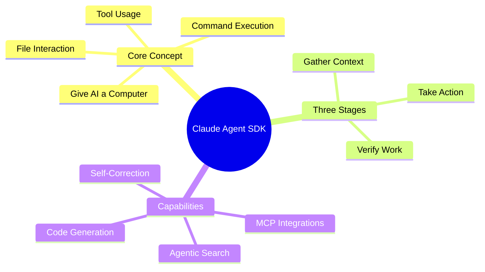
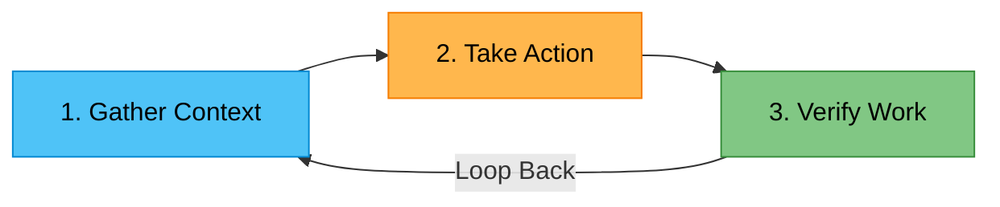
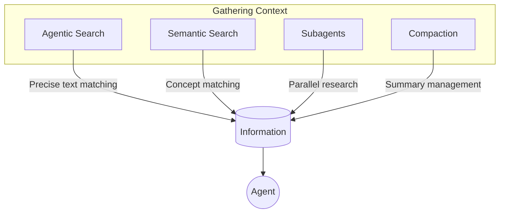
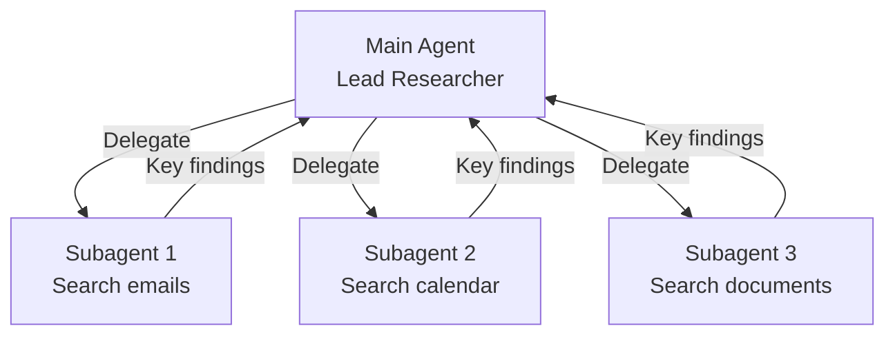
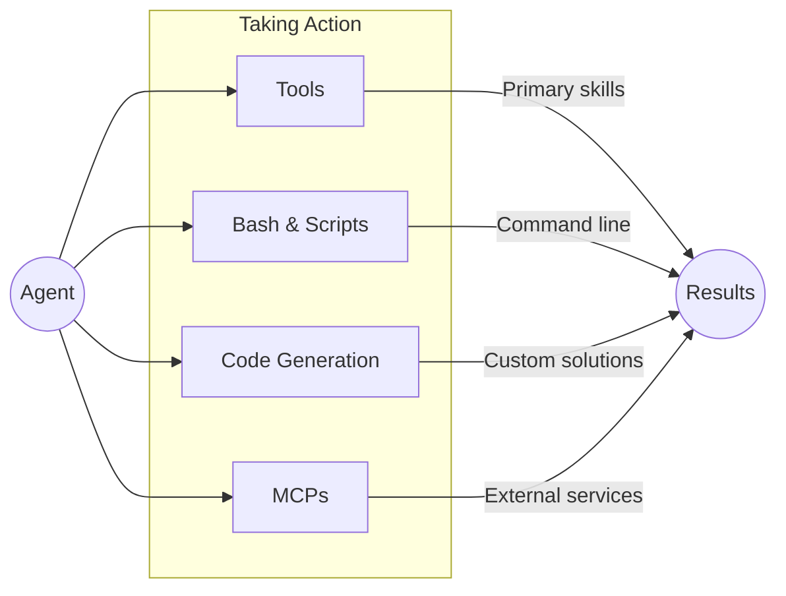
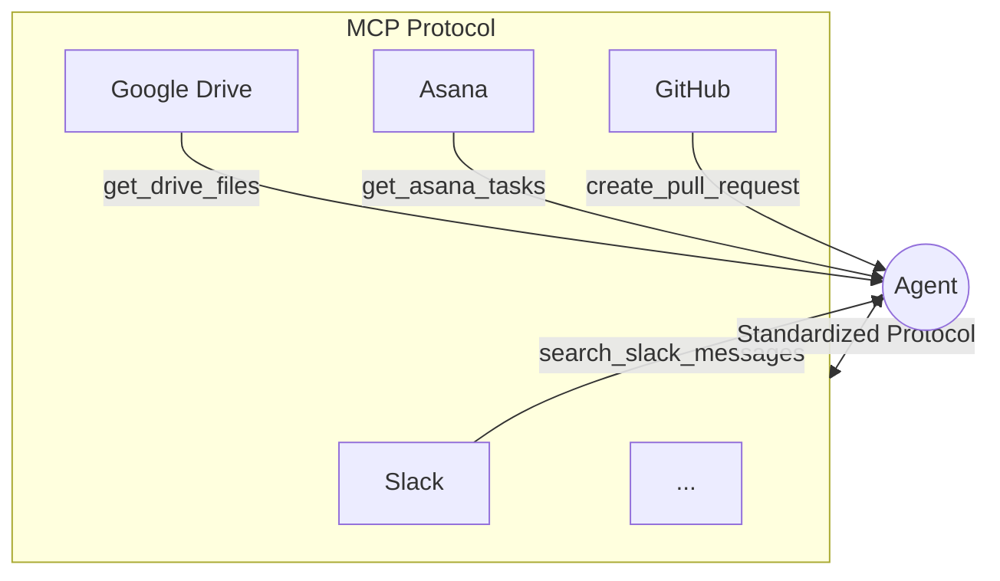
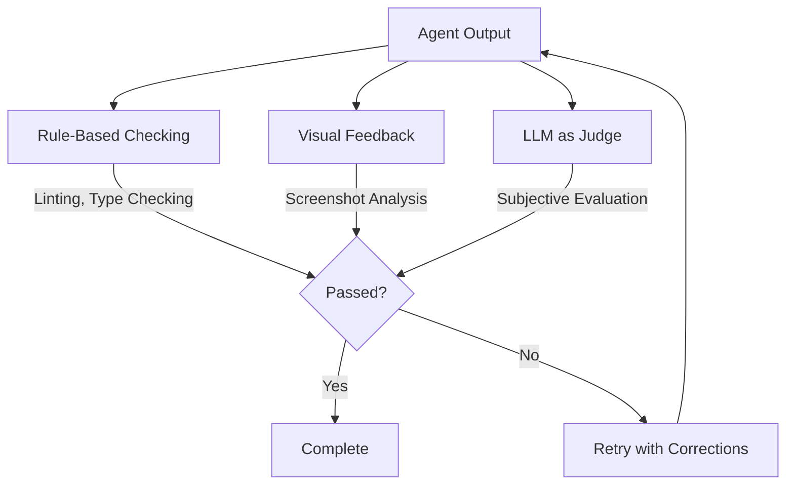
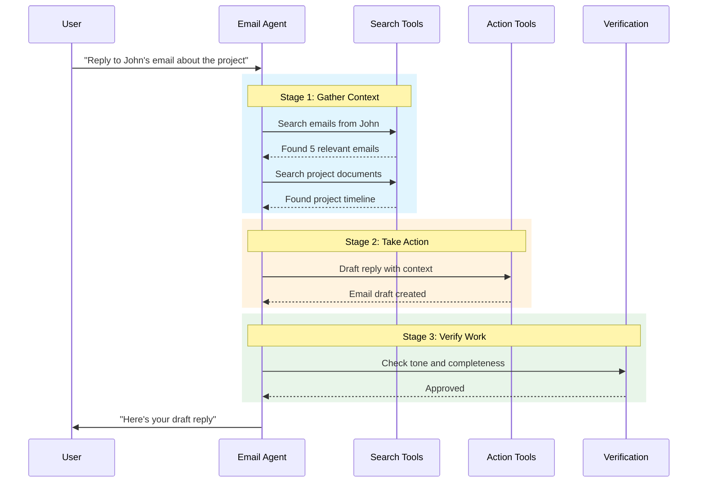

# A Beginner's Guide to the Claude Agent SDK: Giving Your AI a Computer

Welcome to the world of AI agents! This guide is designed for students, enthusiasts, and anyone new to AI development who wants to understand how to build powerful assistants with Anthropic's Claude Agent SDK.

The core idea behind the SDK is simple but powerful: **its purpose is to "give your agents a computer."** This means allowing an AI like Claude to interact with files, run commands, and use digital tools, much like a person does when working on a task.



## The Agent's Workflow: A Three-Step Loop

At the heart of any effective AI agent is a fundamental feedback process called the **"agent loop."** This is a continuous, three-step cycle the agent follows to understand a problem, execute a solution, and check its own performance.



| Stage | Purpose | Key Question |
|-------|---------|--------------|
| **Gather Context** | Research & Understanding | What do I need to know? |
| **Take Action** | Execution & Implementation | How do I accomplish this? |
| **Verify Work** | Validation & Correction | Did I succeed? |

Throughout this guide, we'll use the example of building a smart **"email agent"** to illustrate how these concepts work in practice.

## Step 1: Gathering Context - What the Agent Needs to Know

Before an agent can act, it must first understand the situation by gathering all the relevant information. This is the research phase of its work.



### Agentic Search & The File System: The Digital Librarian

The file system—all the folders and files on a computer—acts as the agent's library of potential information. With **Agentic Search**, the agent acts like a digital librarian. Instead of just knowing about the books, it can physically go to the shelves, pull a book (a file), and use tools like the `grep` command to find specific lines of text inside.

> For example, our email agent could search a folder named `Conversations` to find past discussions and retrieve important context before drafting a reply.

### Semantic Search: Finding Ideas, Not Just Words

**Semantic Search** is a different approach where the agent searches for concepts and meanings, not just exact text matches. This is like a librarian using a sophisticated digital catalog that understands topics and themes, allowing it to find relevant books even if they don't contain the user's exact search words.

### Comparing Search Methods

| Feature | Agentic Search | Semantic Search |
|---------|---------------|-----------------|
| **Speed** | Slower | Usually Faster |
| **Accuracy** | More Accurate & Transparent | Less Accurate, Less Transparent |
| **Maintenance** | Simpler to implement | More difficult to maintain |
| **Best Use Case** | Default for precise retrieval | When speed or conceptual matches matter more |

> **Key Recommendation**: Start with agentic search, and only add semantic search if you need faster results or more variations.

### Subagents: Delegating the Research

You can think of a **subagent** as a junior researcher on a team. A lead researcher (the main agent) can delegate specific research tasks to multiple junior researchers (subagents), who then report back with only their key findings.



**Two Major Benefits:**

1. **Parallelization**: Multiple subagents work on different tasks simultaneously, dramatically speeding up research
2. **Context Management**: Each subagent operates in isolation, sending only relevant summaries back to the main agent

### Compaction: Keeping the Conversation Focused

The `compact` feature is an automatic tool for managing long-running conversations. Think of it as a helpful meeting assistant that automatically summarizes the conversation as it goes on, ensuring the agent always remembers the main points without exceeding its context limit.

## Step 2: Taking Action - How the Agent Gets Things Done

This stage is where the agent uses its various capabilities to execute tasks and work towards completing its goal.



### Tools: The Agent's Primary Skills

**"Tools"** are the main, pre-defined actions an agent is designed to perform. These are the skills it will consider first when deciding how to approach a task.

```typescript
// Example: Email Agent's Primary Tools
const emailAgentTools = {
  fetchInbox: () => { /* Retrieve inbox messages */ },
  searchEmails: (query: string) => { /* Search email history */ },
  sendEmail: (to: string, subject: string, body: string) => { /* Send email */ },
  createDraft: (to: string, subject: string, body: string) => { /* Save draft */ }
};
```

### Bash & Scripts: The Universal Toolkit

The ability to use **Bash** gives the agent access to a computer's command line, which acts as a flexible, universal toolkit for a huge variety of tasks.

```bash
# Example: Agent processing an email attachment
# 1. Download the PDF
curl -o attachment.pdf "https://example.com/file.pdf"

# 2. Convert to plain text
pdftotext attachment.pdf attachment.txt

# 3. Search for specific information
grep -i "contract terms" attachment.txt
```

### Code Generation: A Creative Superpower

The Claude Agent SDK excels at generating code. This isn't just a feature; it's a **core design principle**.

> **Why Code Generation Matters**: "Code is precise, composable, and infinitely reusable, making it an ideal output for agents that need to perform complex operations reliably."

When you ask Claude.AI to create complex files, it relies entirely on code generation—writing Python scripts in the background to build perfectly formatted Excel spreadsheets and PowerPoint presentations.

### MCPs (Model Context Protocol): Plug-and-Play Connections

Think of **MCPs** as a universal travel adapter for your agent. This protocol allows your agent to easily connect to many different external services without you needing to write custom integration code.



**Benefits:**
- Focus on agent behavior, not integration code
- Simply call tools like `search_slack_messages` or `get_asana_tasks`
- MCP handles all the complex integration work automatically

## Step 3: Verifying Work - How the Agent Self-Corrects

Reliable agents don't just act; they evaluate their own output to catch mistakes, make corrections, and improve over time.



### Three Ways to Check the Work

#### 1. Defining Rules (Recommended)

This is like using a grammar or spell checker. You provide clear, concrete rules for what a "good" output looks like.

```typescript
// Example: TypeScript + Linting for robust verification
// Instead of just generating JavaScript...

// Generate TypeScript with strict type checking
const generatedCode = agent.generateTypeScript(task);

// Run linting to catch errors automatically
const lintResults = eslint.verify(generatedCode);

// Multiple layers of feedback!
if (lintResults.errors.length > 0) {
  agent.retry(lintResults.errors);
}
```

> **Pro Tip**: Generate TypeScript and lint it. This provides multiple additional layers of feedback compared to plain JavaScript.

#### 2. Visual Feedback

If the agent's task is visual, like formatting an HTML email, it can be shown a screenshot of the final result. The agent can then analyze the image to see if the layout, styling, and content look right.

#### 3. LLM as a Judge (Use with Caution)

This is like getting a second opinion from a colleague, where another AI model "judges" the output based on subjective criteria like tone or style.

> **Warning**: This is "generally not a very robust method, and can have heavy latency tradeoffs." Consider it an advanced technique for situations where even a small performance boost is worth the cost.

### Verification Methods Comparison

| Method | Reliability | Speed | Best For |
|--------|-------------|-------|----------|
| **Rule-Based** | High | Fast | Code, structured data |
| **Visual Feedback** | Medium | Medium | UI, formatting |
| **LLM as Judge** | Low | Slow | Subjective quality |

## Putting It All Together: The Email Agent

Let's see how all three stages work together in our email agent example:



## Getting Started on Your Journey

The Claude Agent SDK makes it easier than ever to build powerful, autonomous agents. By giving your AI access to a computer and a reliable three-step workflow—**gather context, take action, and verify work**—you can create assistants capable of tackling a wide range of digital tasks.

### Quick Start Checklist

```
1. [ ] Install the Claude Agent SDK
2. [ ] Define your agent's primary tools
3. [ ] Set up context gathering methods
4. [ ] Configure verification rules
5. [ ] Test with simple tasks first
6. [ ] Iterate and improve
```

### Key Takeaways

| Principle | Implementation |
|-----------|---------------|
| Start simple | Begin with agentic search before semantic search |
| Use subagents | Parallelize research for complex tasks |
| Generate code | Leverage code for precise, reusable operations |
| Verify everything | Rule-based checks > LLM judges |
| Iterate | The agent loop is continuous improvement |

---

## References

- [Claude Agent SDK Documentation](https://docs.anthropic.com/en/docs/agents-and-tools/claude-agent-sdk) - Anthropic Docs
- [Building effective agents](https://www.anthropic.com/research/building-effective-agents) - Anthropic Research

---

*Ready to build your first AI agent? The Claude Agent SDK is your starting point for creating intelligent assistants that can truly interact with the digital world.*
