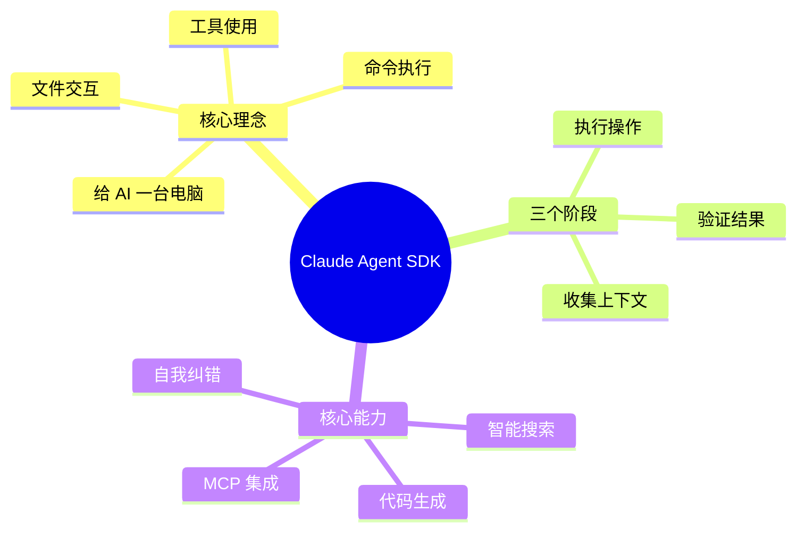
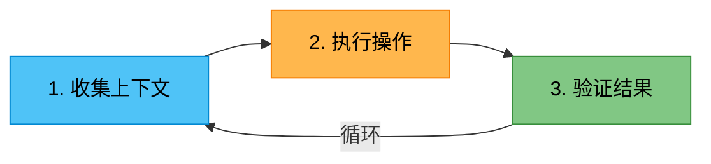
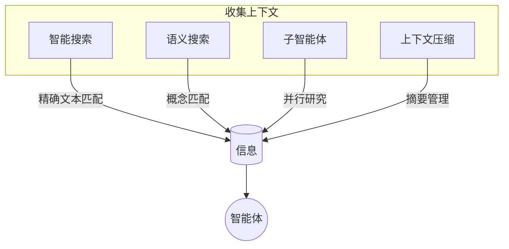
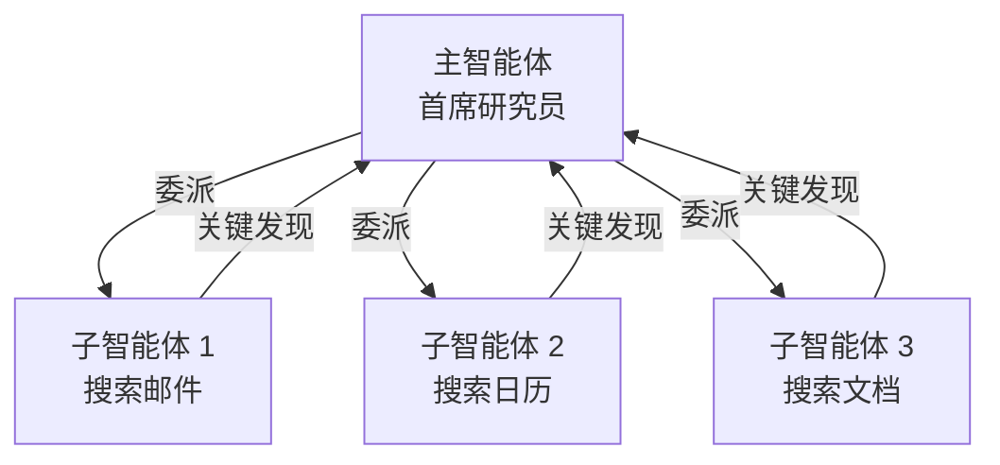
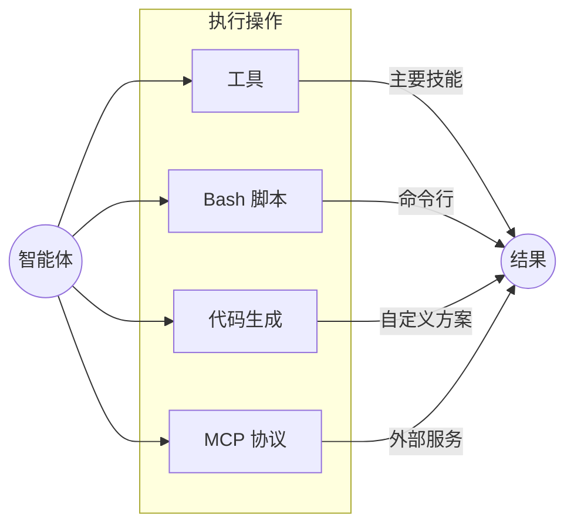
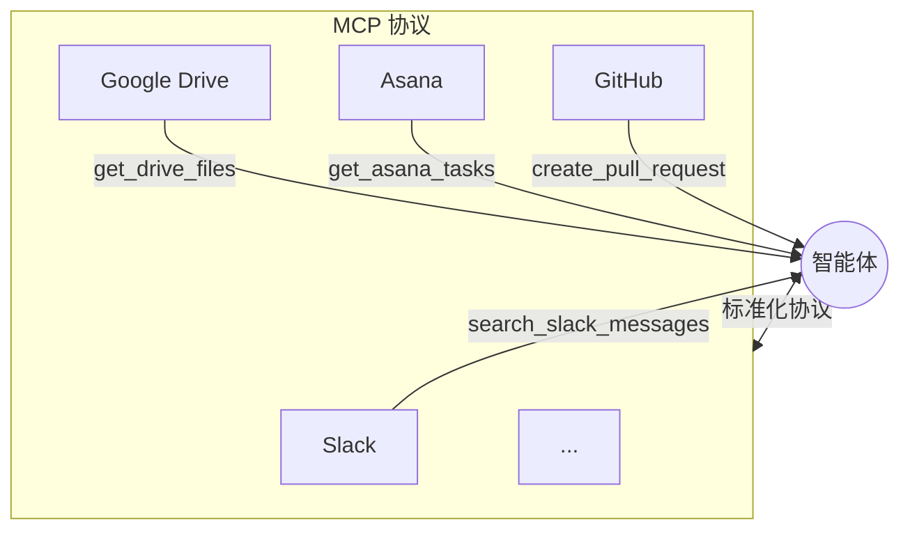
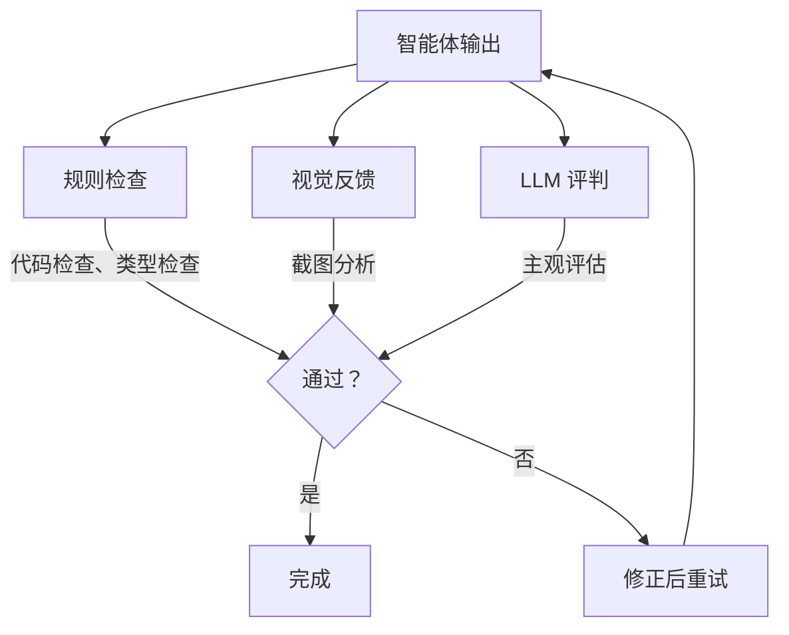
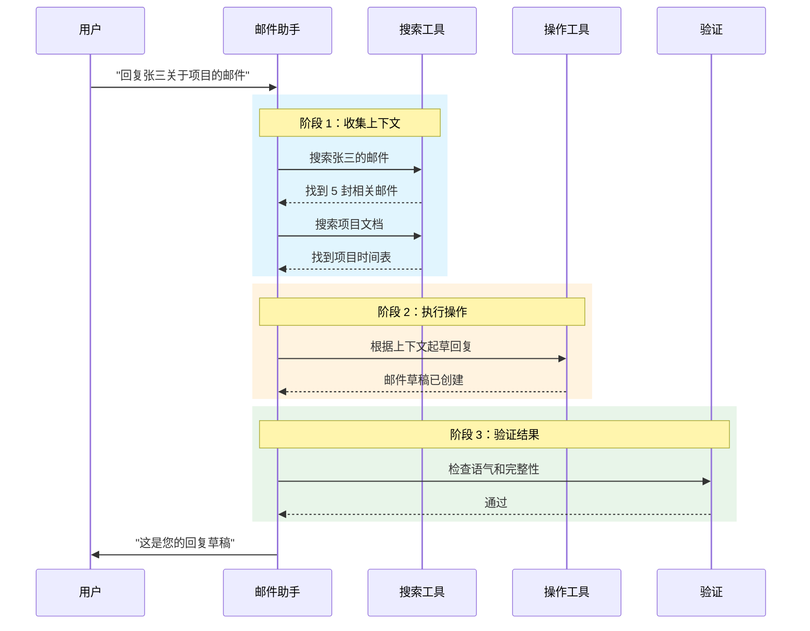

# Claude Agent SDK 入门指南：让你的 AI 拥有一台电脑

欢迎来到 AI 智能体的世界！本指南专为学生、爱好者以及所有想要了解如何使用 Anthropic 的 Claude Agent SDK 构建强大 AI 助手的新手设计。

SDK 背后的核心理念简单而强大：**它的目的是"给你的智能体一台电脑"**。这意味着让 Claude 这样的 AI 能够与文件交互、运行命令、使用数字工具，就像人类处理任务时所做的那样。



## 智能体工作流：三步循环

任何有效 AI 智能体的核心都是一个称为**"智能体循环"**的基本反馈过程。这是一个持续的三步循环，智能体通过它来理解问题、执行解决方案并检查自身表现。



| 阶段 | 目的 | 核心问题 |
|------|------|----------|
| **收集上下文** | 研究与理解 | 我需要知道什么？ |
| **执行操作** | 执行与实现 | 我如何完成这个任务？ |
| **验证结果** | 验证与纠正 | 我成功了吗？ |

在本指南中，我们将以构建一个智能**"邮件助手"**为例，说明这些概念在实践中是如何工作的。

## 第一步：收集上下文 - 智能体需要知道什么

在智能体采取行动之前，它必须首先通过收集所有相关信息来理解情况。这是工作的研究阶段。



### 智能搜索与文件系统：数字图书管理员

文件系统——计算机上的所有文件夹和文件——充当智能体的潜在信息库。通过**智能搜索（Agentic Search）**，智能体就像一个数字图书管理员。它不仅知道书籍的存在，还能亲自去书架取书（文件），并使用 `grep` 等工具在其中查找特定的文本行。

> 例如，我们的邮件助手可以搜索名为 `Conversations` 的文件夹，找到过去的讨论记录，并在起草回复之前获取重要的上下文。

### 语义搜索：寻找想法，而非仅仅是词语

**语义搜索（Semantic Search）**是一种不同的方法，智能体搜索的是概念和含义，而不仅仅是精确的文本匹配。这就像图书管理员使用一个能理解主题的智能目录系统，即使用户搜索的词语不完全匹配，也能找到相关的书籍。

### 搜索方法对比

| 特性 | 智能搜索 | 语义搜索 |
|------|----------|----------|
| **速度** | 较慢 | 通常更快 |
| **准确性** | 更准确、更透明 | 准确性较低、透明度较低 |
| **维护难度** | 实现更简单 | 维护更困难 |
| **最佳场景** | 精确检索的默认选择 | 速度或概念匹配更重要时 |

> **关键建议**：从智能搜索开始，只有在需要更快结果或更多变体时才添加语义搜索。

### 子智能体：委派研究任务

你可以把**子智能体（Subagent）**想象成团队中的初级研究员。主研究员（主智能体）可以将特定的研究任务委派给多个初级研究员（子智能体），然后他们只汇报关键发现。



**两大优势：**

1. **并行化**：多个子智能体同时处理不同任务，大幅加速研究过程
2. **上下文管理**：每个子智能体独立运行，只将相关摘要发送回主智能体

### 上下文压缩：保持对话聚焦

`compact` 功能是管理长时间对话的自动工具。把它想象成一个会议助理，随着对话进行自动进行摘要，确保智能体始终记住要点而不超出上下文限制。

## 第二步：执行操作 - 智能体如何完成任务

这个阶段是智能体使用各种能力执行任务、朝着完成目标前进的阶段。



### 工具：智能体的主要技能

**"工具（Tools）"**是智能体设计用来执行的主要预定义操作。这些是它在决定如何处理任务时首先考虑的技能。

```typescript
// 示例：邮件助手的主要工具
const emailAgentTools = {
  fetchInbox: () => { /* 获取收件箱消息 */ },
  searchEmails: (query: string) => { /* 搜索邮件历史 */ },
  sendEmail: (to: string, subject: string, body: string) => { /* 发送邮件 */ },
  createDraft: (to: string, subject: string, body: string) => { /* 保存草稿 */ }
};
```

### Bash 脚本：万能工具箱

使用 **Bash** 的能力让智能体能够访问计算机的命令行，这相当于一个灵活的万能工具箱，可以完成各种各样的任务。

```bash
# 示例：智能体处理邮件附件
# 1. 下载 PDF
curl -o attachment.pdf "https://example.com/file.pdf"

# 2. 转换为纯文本
pdftotext attachment.pdf attachment.txt

# 3. 搜索特定信息
grep -i "合同条款" attachment.txt
```

### 代码生成：创造性超能力

Claude Agent SDK 擅长生成代码。这不仅仅是一个功能；它是一个**核心设计原则**。

> **为什么代码生成如此重要**："代码是精确的、可组合的、可无限复用的，这使它成为需要可靠执行复杂操作的智能体的理想输出。"

当你让 Claude.AI 创建复杂文件时，它完全依赖代码生成——在后台编写 Python 脚本来构建格式完美的 Excel 电子表格和 PowerPoint 演示文稿。

### MCP（模型上下文协议）：即插即用的连接

把 **MCP** 想象成智能体的万能转换插头。这个协议让你的智能体能够轻松连接到许多不同的外部服务，而无需为每个服务编写自定义集成代码。



**优势：**
- 专注于智能体行为，而非集成代码
- 只需调用 `search_slack_messages` 或 `get_asana_tasks` 等工具
- MCP 自动处理所有复杂的集成工作

## 第三步：验证结果 - 智能体如何自我纠正

可靠的智能体不仅仅是行动；它们还会评估自己的输出，以发现错误、进行纠正并随时间改进。



### 三种检查方法

#### 1. 定义规则（推荐）

这就像使用语法或拼写检查器。你提供清晰、具体的规则来定义什么是"好的"输出。

```typescript
// 示例：TypeScript + Linting 实现稳健验证
// 不要只是生成 JavaScript...

// 生成带严格类型检查的 TypeScript
const generatedCode = agent.generateTypeScript(task);

// 运行 linting 自动捕获错误
const lintResults = eslint.verify(generatedCode);

// 多层反馈！
if (lintResults.errors.length > 0) {
  agent.retry(lintResults.errors);
}
```

> **专业提示**：生成 TypeScript 并进行 lint 检查。相比纯 JavaScript，这提供了多层额外的反馈。

#### 2. 视觉反馈

如果智能体的任务是视觉相关的，比如格式化 HTML 邮件，可以向它展示最终结果的截图。智能体可以分析图像，检查布局、样式和内容是否正确。

#### 3. LLM 作为评判（谨慎使用）

这就像从同事那里获得第二意见，另一个 AI 模型根据主观标准（如语气或风格）来"评判"输出。

> **警告**：这"通常不是一个非常稳健的方法，并且可能有很大的延迟代价。"只在即使很小的性能提升也值得付出代价的情况下考虑使用这种高级技术。

### 验证方法对比

| 方法 | 可靠性 | 速度 | 最适合 |
|------|--------|------|--------|
| **基于规则** | 高 | 快 | 代码、结构化数据 |
| **视觉反馈** | 中 | 中 | UI、格式化 |
| **LLM 评判** | 低 | 慢 | 主观质量 |

## 完整示例：邮件助手

让我们看看这三个阶段如何在邮件助手示例中协同工作：



## 开始你的旅程

Claude Agent SDK 让构建强大的自主智能体变得前所未有的简单。通过给你的 AI 提供计算机访问权限和可靠的三步工作流——**收集上下文、执行操作和验证结果**——你可以创建能够处理各种数字任务的助手。

### 快速入门清单

```
1. [ ] 安装 Claude Agent SDK
2. [ ] 定义智能体的主要工具
3. [ ] 设置上下文收集方法
4. [ ] 配置验证规则
5. [ ] 先用简单任务测试
6. [ ] 迭代和改进
```

### 关键要点

| 原则 | 实践方法 |
|------|----------|
| 从简单开始 | 先使用智能搜索，再考虑语义搜索 |
| 使用子智能体 | 为复杂任务并行化研究 |
| 生成代码 | 利用代码实现精确、可复用的操作 |
| 验证一切 | 基于规则的检查 > LLM 评判 |
| 持续迭代 | 智能体循环就是持续改进 |

---

## 参考资料

- [Claude Agent SDK Documentation](https://docs.anthropic.com/en/docs/agents-and-tools/claude-agent-sdk) - Anthropic Docs
- [Building effective agents](https://www.anthropic.com/research/building-effective-agents) - Anthropic Research

---

*准备好构建你的第一个 AI 智能体了吗？Claude Agent SDK 是你创建能够真正与数字世界交互的智能助手的起点。*
