# 2026 Complete Guide to Opening a Hong Kong Bank Account

As globalization deepens and cross-border business expands, having a Hong Kong bank account has become increasingly valuable. Whether you're looking to invest in Hong Kong or US stocks, receive overseas income, or diversify your assets, this guide will help you navigate the account opening process successfully.


## Why Do You Need a Hong Kong Bank Account?

Hong Kong, as an international financial center, offers unique advantages:


### Main Use Cases

| Scenario | Specific Needs | Recommended Bank |
|----------|---------------|------------------|
| Stock Investment | Broker deposits/withdrawals | HSBC, BOCHK |
| Overseas Income | Freelancing/Remote Work | ZA Bank |
| E-commerce | PayPal, Trade Payments | BOCHK, Standard Chartered |
| Asset Allocation | USD Savings, Insurance | HSBC Premier, Citibank |

## Comparison of Major Hong Kong Banks


### Detailed Bank Comparison

#### Traditional Banks

| Bank | Minimum Deposit | Monthly Fee | Pros | Cons |
|------|----------------|-------------|------|------|
| **HSBC** | HKD 10,000 | Waived with conditions | High international recognition | Higher threshold |
| **Bank of China HK** | Lower | Low | Good mainland connection | Slower int'l transfers |
| **Hang Seng Bank** | Medium | Waived with conditions | Rich investment products | Harder for non-residents |
| **Standard Chartered** | Medium | Waived with conditions | Good international network | Fewer branches |

#### Virtual Banks (Recommended for Beginners)

| Bank | Application | Features | Best For |
|------|-------------|----------|----------|
| **ZA Bank** ⭐ | 100% Online | Fastest approval, user-friendly, zero fees | First-time applicants |
| **Airstar Bank** | 100% Online | Xiaomi ecosystem, good rates | Xiaomi users |
| **Mox Bank** | 100% Online | Standard Chartered backed | Conservative users |

> 💡 **Top Pick for Beginners**: If this is your first Hong Kong bank account, we highly recommend **ZA Bank**. Fully online application, no need to visit Hong Kong, no minimum deposit, zero account fees, and you can get approved as fast as the same day.

## Choosing Your Application Method

```mermaid
flowchart TD
    A[Choose Application Method] --> B{Can you visit HK?}
    B -->|Yes| C[In-person Application]
    B -->|No| D{Fund requirements?}

    C --> C1[Traditional Bank Branch]
    C --> C2[Virtual Bank + In-person Verification]

    D -->|Large amount/Full services| E[Witness Account Opening]
    D -->|Small amount/Temporary| F[Online Virtual Bank]

    C1 --> G[✅ Full-feature Account]
    E --> H[✅ Remote Traditional Bank Access]
    F --> I[✅ Quick Basic Account]

    style G fill:#90EE90
    style H fill:#90EE90
    style I fill:#90EE90
```



### Three Application Methods Explained

#### Method 1: In-person in Hong Kong (Recommended)

**Advantages**: Highest success rate, full features, best service

**Process**:
1. Book appointment in advance (Very important!)
2. Visit with required documents
3. Bank interview (About 30-60 minutes)
4. Receive card on-site or by mail

#### Method 2: Witness Account Opening (Mainland China)

**Available Banks**: HSBC, BOCHK, CMB Wing Lung, etc.

**Process**:
1. Book at designated mainland branches
2. Complete video/in-person verification
3. Hong Kong review process
4. Card and security device mailed

#### Method 3: Online Application (Virtual Banks)

**Available Banks**: ZA Bank, Airstar Bank, Mox, etc.

**Process**:
1. Download app and register
2. Upload ID photos
3. Face verification
4. Wait for approval (Usually 1-3 days)

## Required Documents Checklist


### Document Details

#### Essential Documents ✅

| Document | Requirement | Notes |
|----------|-------------|-------|
| **ID Card** | Original | Must be valid |
| **Travel Permit** | Original + valid visa | Or valid passport |
| **Entry Slip** | Same-day entry proof | Required by some banks |
| **Address Proof** | Within 3 months | Utility bill/Bank statement |

#### Acceptable Address Proof

- 📧 Credit card statement
- 💡 Utility bills (water/electricity)
- 📱 Phone bill
- 🏠 Residence certificate
- 🏦 Bank deposit certificate

> **Tip**: Address proof must include your name and detailed address, dated within 3 months.

## Step-by-Step Application Process

Here's a typical **in-person traditional bank** application:


### Step 1: Make an Appointment

**Why book in advance?**
- Walk-ins face long wait times
- Some banks don't accept walk-ins
- Can request English/Mandarin service

**Booking Channels**:
- Bank official website
- Bank mobile app
- Customer service hotline

### Step 2: Prepare for Interview

Common interview questions:


**Answer Tips**:
- 🎯 Clear purpose: Stock investment, savings, business transactions
- 💰 Legitimate source: Salary, investment returns, business income
- 📊 Match your profile: Income should align with occupation

### Step 3: Activation

After successful opening:
1. Download bank app
2. Activate online banking
3. Set transfer limits
4. Link phone number (HK number recommended)

## Tips for Higher Success Rate


### High Success Strategies

#### 1. Choose the Right Bank

- **First account**: Consider BOCHK or virtual banks
- **Significant assets**: Try HSBC, Standard Chartered
- **Urgent need**: Prioritize virtual banks

#### 2. Thorough Document Preparation

```
✅ All essential documents ready
✅ Address proof within validity
✅ Prepare bilingual materials
✅ Bring extra supporting documents
```

#### 3. Interview Performance

- Dress professionally
- Answer clearly without hesitation
- Proactively explain account purpose
- Avoid sensitive terms

## Frequently Asked Questions

### Q1: No Hong Kong phone number?

**Solutions**:
1. Buy HK SIM card online before trip
2. Use mainland number (some banks accept)
3. Purchase local SIM upon arrival

### Q2: Address proof doesn't meet requirements?

**Alternatives**:
- Print electronic credit card statement
- Request bank deposit certificate
- Use residence certificate template

### Q3: Application rejected?


### Q4: How to fund the account?

| Method | Fee | Processing Time | Limit |
|--------|-----|-----------------|-------|
| Bank Wire | $15-30 | 1-3 business days | $50K USD/year |
| Transfer from friend | Free | Instant | Unlimited |
| Broker Transfer | Varies | 1-2 business days | Unlimited |

## Post-Opening Tips

### Keep Account Active


### Avoid Account Freezing

- ⚠️ Avoid frequent large transactions
- ⚠️ Avoid transactions with high-risk regions
- ⚠️ Maintain account activity
- ⚠️ Update personal information promptly

## Summary


Opening a Hong Kong bank account isn't difficult. The keys are:
1. **Choose wisely**: Select a bank that matches your needs
2. **Prepare thoroughly**: Better to over-prepare than under-prepare
3. **Be genuine**: Show honest intentions during the interview

Good luck with your application! Feel free to ask questions in the comments.

---

## 🎁 Exclusive Reader Bonus

If you decide to open an account with **ZA Bank**, here's an exclusive bonus for you:

<div style={{background: 'linear-gradient(135deg, #667eea 0%, #764ba2 100%)', padding: '24px', borderRadius: '12px', color: 'white', margin: '20px 0'}}>

### 🏦 ZA Bank Welcome Rewards

**Use our referral code to enjoy rewards worth up to HKD 2,026!**

✨ **Account Opening Rewards**:
- 💰 Exclusive welcome bonus for new customers
- 📈 **3% stock cashback** on card spending
- 🎯 No minimum deposit, zero account maintenance fee

✨ **Why ZA Bank**:
- ✅ 100% online application, no branch visit needed
- ✅ 24/7 banking services
- ✅ User-friendly interface, simple operations

**👉 Referral Code: `P8KX83`**

[Open Account & Claim Rewards →](https://l.za.group/oczrP)

</div>

> ⚠️ Investment involves risks. Subject to terms and conditions. This material may only be distributed or circulated in Hong Kong. [View full terms](https://l.za.group/iAF3x)

---

*Disclaimer: This article is for reference only. Specific requirements are subject to each bank's official policies. Bank policies may change at any time. Please confirm the latest requirements with official customer service before applying.*
