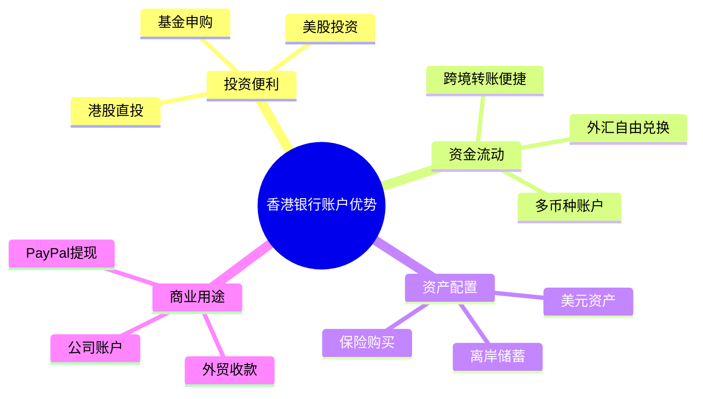
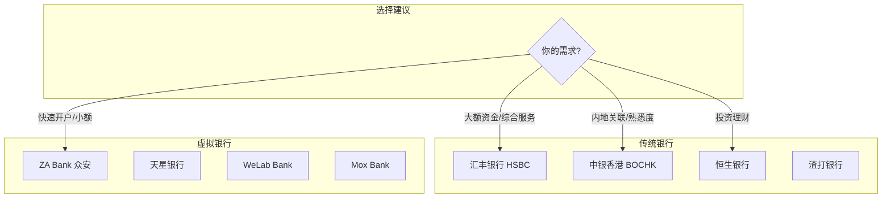
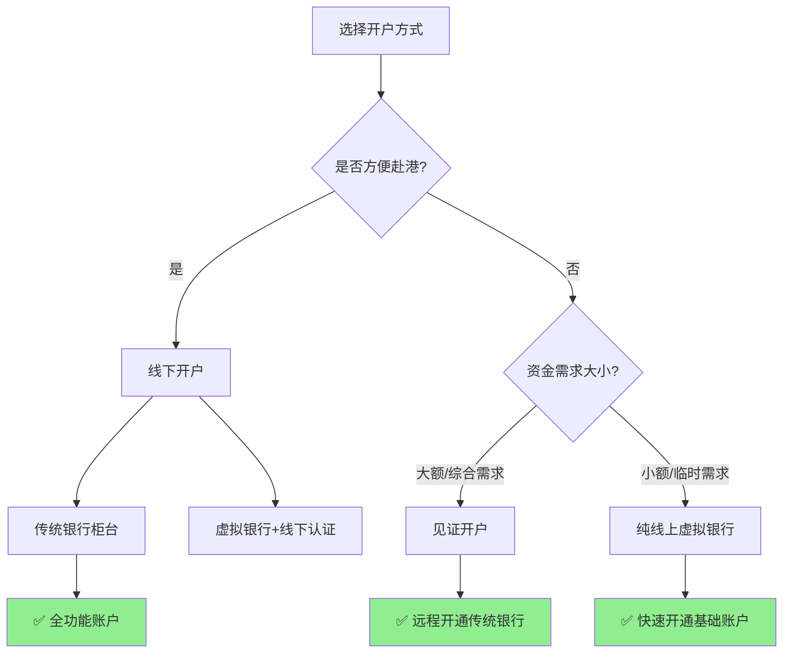
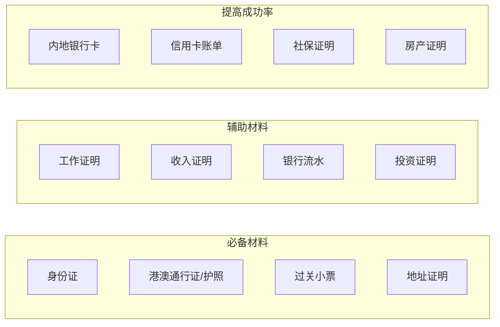
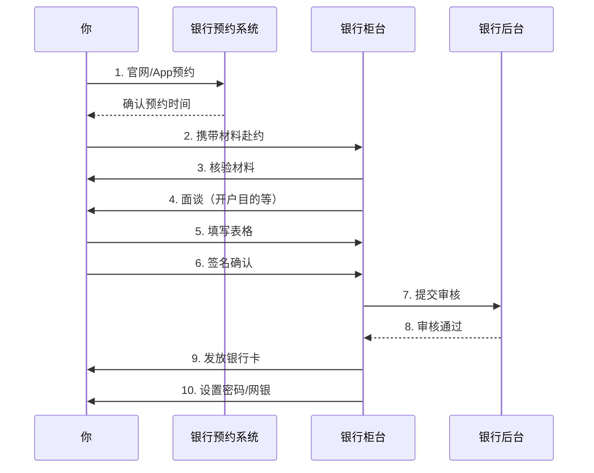
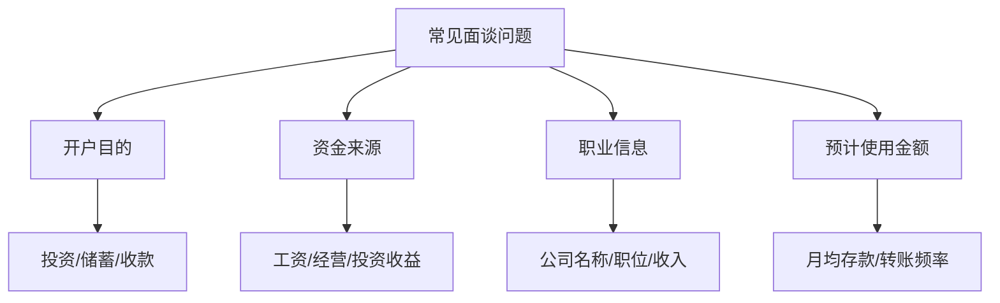
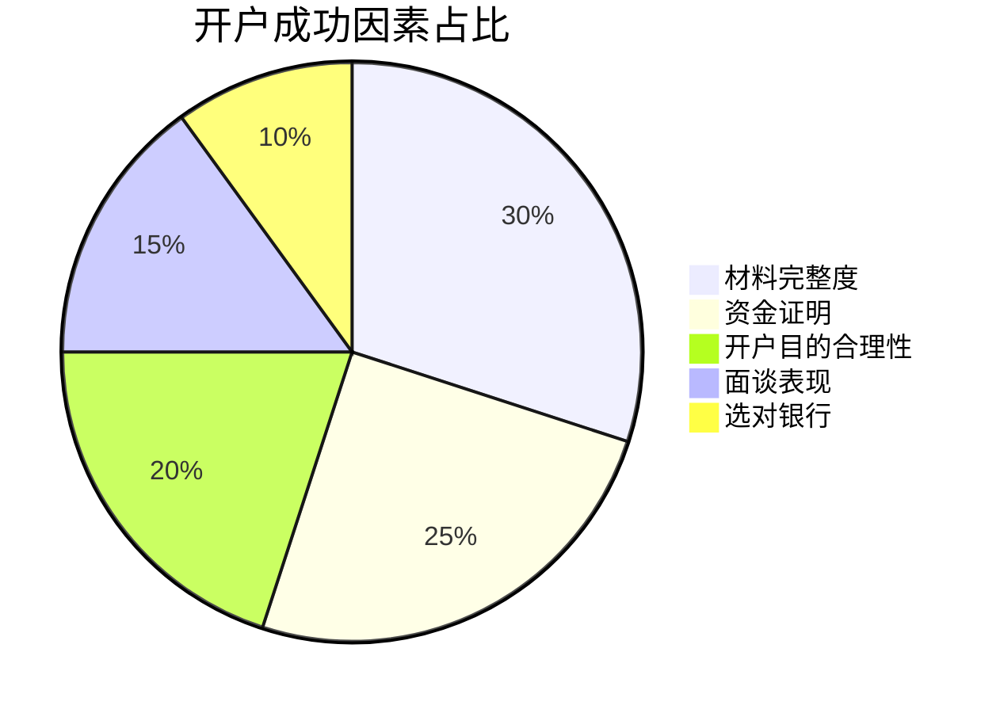
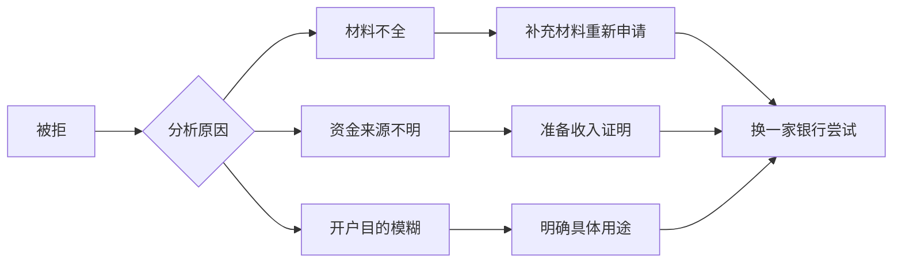
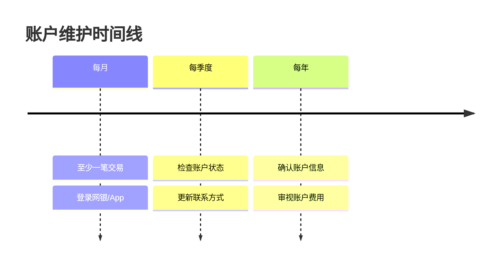
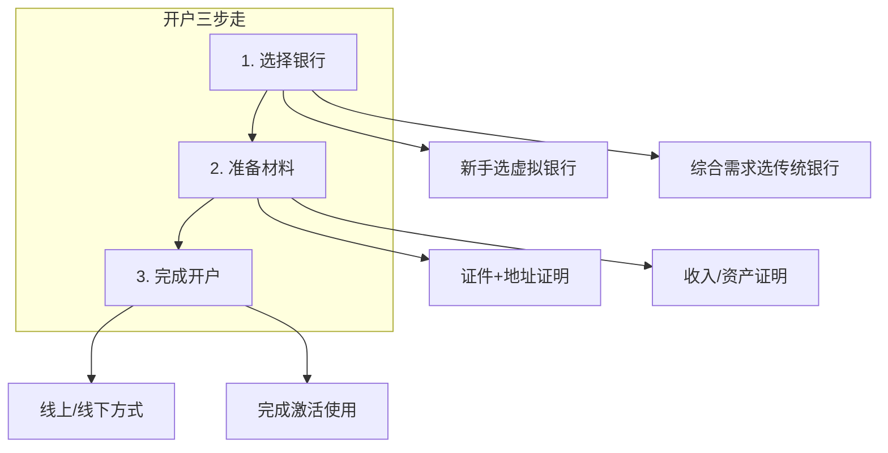

# 2026 香港银行开户完全指南

随着全球化的深入和跨境业务的增加，拥有一个香港银行账户变得越来越重要。无论你是为了投资港美股、接收海外收入，还是为了资产配置，这篇教程都将帮助你顺利开户。


## 为什么需要香港银行账户？

香港作为国际金融中心，拥有独特的优势：



### 主要用途场景

| 场景 | 具体需求 | 推荐银行 |
|------|----------|----------|
| 港美股投资 | 券商出入金 | 汇丰、中银香港 |
| 海外收入 | 自由职业/远程工作 | 众安、ZA Bank |
| 跨境电商 | PayPal、外贸收款 | 中银香港、渣打 |
| 资产配置 | 美元储蓄、保险 | 汇丰卓越、花旗 |

## 香港主流银行对比



### 银行详细对比

#### 传统银行

| 银行 | 开户门槛 | 管理费 | 优势 | 劣势 |
|------|----------|--------|------|------|
| **汇丰银行** | 1万港币 | 有条件免 | 国际认可度高，网点多 | 门槛较高，审核严 |
| **中银香港** | 较低 | 低 | 内地关联好，中文服务 | 国际转账稍慢 |
| **恒生银行** | 中等 | 有条件免 | 投资产品丰富 | 非港人开户难 |
| **渣打银行** | 中等 | 有条件免 | 国际网络好 | 网点较少 |

#### 虚拟银行（推荐新手）

| 银行 | 开户方式 | 特点 | 适合人群 |
|------|----------|------|----------|
| **ZA Bank** ⭐ | 纯线上 | 开户最快，界面友好，无管理费 | 初次开户者 |
| **天星银行** | 纯线上 | 小米生态，汇率好 | 小米用户 |
| **Mox Bank** | 纯线上 | 渣打背景，稳定 | 稳健型用户 |

> 💡 **新手首选推荐**：如果你是第一次开香港银行账户，强烈推荐 **ZA Bank 众安银行**。全程线上操作，无需亲赴香港，无最低存款要求，零账户管理费，最快当天就能开户成功。

## 开户方式选择



### 三种开户方式详解

#### 方式一：亲赴香港开户（推荐）

**优点**：成功率最高、功能最全、服务最好

**流程**：
1. 提前预约（非常重要！）
2. 携带材料赴港
3. 银行面谈（约30-60分钟）
4. 当场或邮寄收卡

#### 方式二：内地见证开户

**适用银行**：汇丰、中银香港、招商永隆等

**流程**：
1. 在指定内地网点预约
2. 完成视频/现场见证
3. 香港方面审核
4. 邮寄卡片和密码器

#### 方式三：线上开户（虚拟银行）

**适用银行**：ZA Bank、天星银行、Mox等

**流程**：
1. 下载 App 注册
2. 上传证件照片
3. 人脸识别验证
4. 等待审核（通常1-3天）

## 开户材料清单



### 材料详细说明

#### 必备材料 ✅

| 材料 | 要求 | 注意事项 |
|------|------|----------|
| **身份证** | 原件 | 确保在有效期内 |
| **港澳通行证** | 原件+有效签注 | 或有效护照 |
| **过关小票** | 当天入境凭证 | 部分银行必须 |
| **地址证明** | 3个月内 | 水电费单/银行账单 |

#### 地址证明可选材料

- 📧 内地银行信用卡账单
- 💡 水电费缴费单
- 📱 手机话费账单
- 🏠 居住证明（居委会开具）
- 🏦 银行存款证明

> **提示**：地址证明必须有你的姓名和详细地址，且在3个月以内。

## 开户流程详解

以最常见的**线下传统银行开户**为例：



### Step 1: 预约

**为什么要预约？**
- 非预约客户等待时间长
- 部分银行不接受非预约客户
- 可以选择普通话服务

**预约渠道**：
- 银行官网在线预约
- 银行 App 预约
- 客服电话预约

### Step 2: 面谈准备

银行会询问的问题：



**回答技巧**：
- 🎯 目的明确：投资港股、储蓄、商务往来等
- 💰 资金合规：工资收入、投资收益、经营所得
- 📊 符合身份：收入与职业匹配

### Step 3: 激活使用

开户成功后：
1. 下载银行 App
2. 激活网上银行
3. 设置转账限额
4. 绑定手机号（建议香港号）

## 开户成功率提升技巧



### 高成功率策略

#### 1. 选择合适的银行

- **首次开户**：建议选择中银香港或虚拟银行
- **有一定资产**：可以尝试汇丰、渣打
- **急需使用**：优先虚拟银行

#### 2. 材料准备充分

```
✅ 必备材料全部带齐
✅ 地址证明在有效期内
✅ 准备中英文材料
✅ 多准备辅助材料
```

#### 3. 面谈表现

- 着装得体，展现专业性
- 回答清晰，不要犹豫
- 主动说明开户目的
- 避免敏感词汇（炒股、洗钱等）

## 常见问题 FAQ

### Q1: 没有香港手机号怎么办？

**解决方案**：
1. 提前购买香港电话卡（淘宝/实体店）
2. 使用内地手机号（部分银行支持）
3. 到港后购买当地 SIM 卡

### Q2: 地址证明不符合要求？

**备选方案**：
- 信用卡电子账单打印
- 申请银行开具存款证明
- 使用居住证明模板

### Q3: 开户被拒怎么办？



### Q4: 开户后如何入金？

| 入金方式 | 手续费 | 到账时间 | 限额 |
|----------|--------|----------|------|
| 银行电汇 | 100-200元 | 1-3工作日 | 5万美元/年 |
| 熟人转账 | 免费 | 即时 | 无限制 |
| 券商出金 | 视情况 | 1-2工作日 | 无限制 |

## 开户后注意事项

### 保持账户活跃



### 避免账户被冻结

- ⚠️ 避免频繁大额进出
- ⚠️ 避免与高风险地区交易
- ⚠️ 保持账户活跃度
- ⚠️ 及时更新个人信息

## 总结



开户香港银行账户并不难，关键是：
1. **选对银行**：根据需求选择合适的银行
2. **备齐材料**：宁多勿少，充分准备
3. **态度诚恳**：面谈时展现真实目的

祝你开户顺利！如有问题，欢迎在评论区讨论。

---

## 🎁 读者专属福利

如果你决定选择 **ZA Bank 众安银行** 开户，这里有一份专属福利送给你：

<div style={{background: 'linear-gradient(135deg, #667eea 0%, #764ba2 100%)', padding: '24px', borderRadius: '12px', color: 'white', margin: '20px 0'}}>

### 🏦 ZA Bank 开户奖赏

**使用专属邀请码开户，享价值 HKD 2,026 奖赏！**

✨ **开户福利**：
- 💰 新客户专属迎新奖赏
- 📈 刷卡消费享 **3% 股票回赠**
- 🎯 无最低存款要求，零账户管理费

✨ **ZA Bank 优势**：
- ✅ 全线上开户，无需前往分行
- ✅ 24x7 全天候银行服务
- ✅ 界面友好，操作简单

**👉 专属邀请码：`P8KX83`**

[立即开户领取奖赏 →](https://l.za.group/oczrP)

</div>

> ⚠️ 投资涉及风险，受条款及细则约束。此资料仅可于香港境内分发或传阅。[查看完整条款](https://l.za.group/iAF3x)

---

*免责声明：本文仅供参考，具体开户要求以各银行官方规定为准。银行政策可能随时调整，建议开户前咨询官方客服确认最新要求。*
