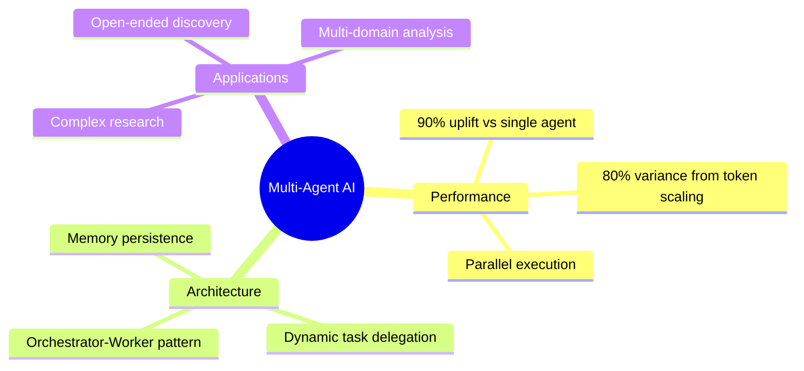
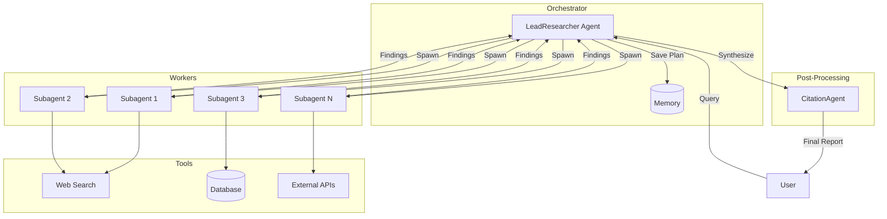
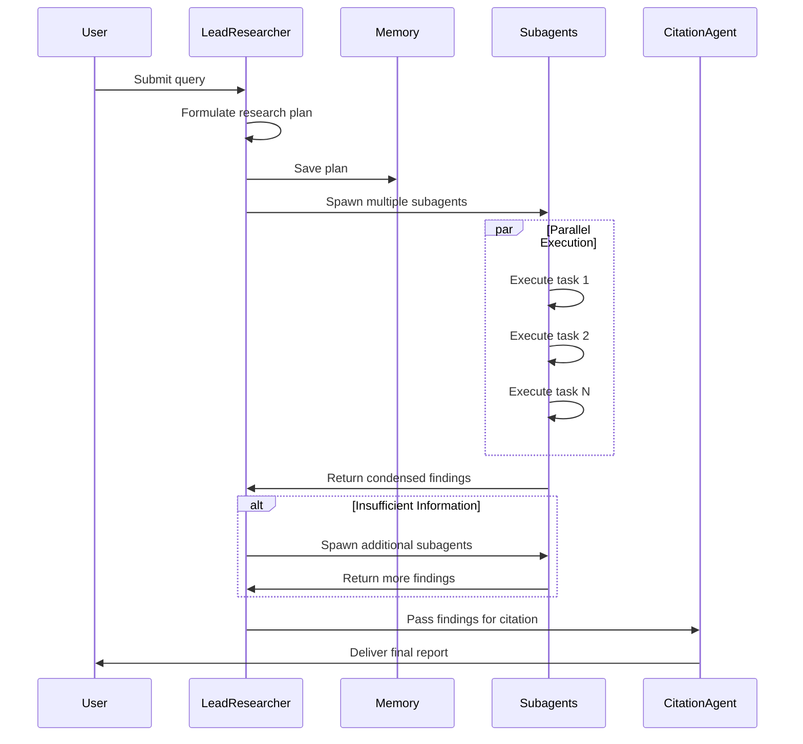
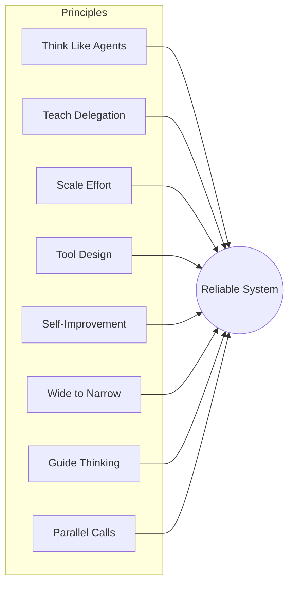
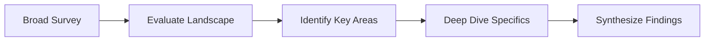
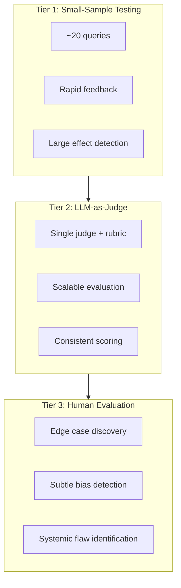
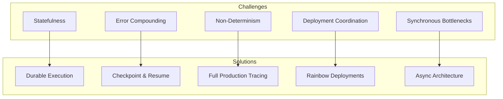
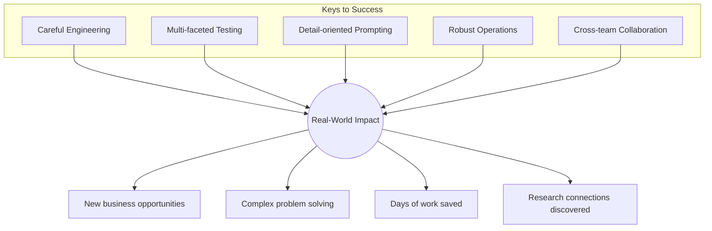

# Architecting Production-Grade Multi-Agent AI Systems

As the capabilities of individual AI models advance, the next frontier lies not just in enhancing single models but in scaling their **collective intelligence**. Multi-agent systems—where multiple Large Language Models work together, autonomously using tools in a coordinated loop—mark a significant departure from linear, one-shot pipelines.



## Why Multi-Agent Systems?

Traditional single-agent systems struggle with the dynamic nature of in-depth research. Discovery isn't linear—it requires flexibility to pivot, explore tangents, and update strategy based on intermediate findings.

### Quantifiable Benefits

| Metric | Result |
|--------|--------|
| **Performance Uplift** | 90.2% improvement over single-agent |
| **Token Scaling Impact** | 80% of performance variance explained |
| **Task Parallelization** | Significant gains in quality and speed |

Multi-agent systems excel when tasks are:
- Valuable and complex
- Heavily parallelizable
- Require processing beyond a single context window
- Involve interfacing with numerous tools

## System Architecture: The Orchestrator-Worker Framework

The system employs an **orchestrator-worker pattern** where a central lead agent coordinates the research process while delegating specific tasks to specialized worker agents (subagents) that operate concurrently.



### Core Components

| Component | Role | Responsibility |
|-----------|------|----------------|
| **LeadResearcher** | Orchestrator | Analyzes queries, develops plans, spawns subagents, synthesizes findings |
| **Memory** | Persistence | Stores research plan outside context window for long-running tasks |
| **Subagents** | Workers | Execute specific research tasks in parallel with tool access |
| **CitationAgent** | Post-processor | Reviews report and inserts precise source citations |

### The Research Workflow



### Why This Architecture Wins

This dynamic, multi-step approach offers significant advantages over static RAG systems:

- **Adaptive Search**: Continuously adapts strategy based on findings
- **Parallel Investigation**: Independent explorations reduce path dependency
- **Intelligent Compression**: Subagents filter and compress vast information spaces
- **Clear Separation**: Distinct concerns enable focused optimization

## Prompt Engineering: Guiding Collaborative Behavior

In multi-agent systems, prompt engineering is the primary lever for steering behavior and mitigating coordination complexity. Minor changes to a lead agent can unpredictably alter how subagents behave.

### Eight Critical Principles



#### 1. Think Like Your Agents

Build an accurate mental model of how agents interpret prompts. Simulate behavior step-by-step to reveal failure modes like:
- Continuing search after sufficient results
- Selecting incorrect tools
- Missing obvious information

#### 2. Teach the Orchestrator How to Delegate

Vague task descriptions lead to duplicated work. Effective delegation includes:

```
✅ Specific objective
✅ Defined output format
✅ Tool and source guidance
✅ Clear boundaries
```

**Bad**: "Research the semiconductor shortage"
**Good**: "Investigate 2025 supply chain impacts on automotive sector, focusing on TSMC and Samsung capacity. Output: bullet summary with sources."

#### 3. Scale Effort to Query Complexity

Embed explicit scaling rules in the orchestrator's prompt:

| Query Type | Agents | Tool Calls |
|------------|--------|------------|
| Simple fact-finding | 1 | Few |
| Moderate research | 3-5 | 10-20 |
| Complex analysis | 10+ | 50+ |

#### 4. Tool Design and Selection Are Critical

Agents must have explicit heuristics for tool selection:
- Examine all available tools before starting
- Match tool usage to user intent
- Wrong tool choice can be fatal to a task

> An agent searching the web for context that only exists in Slack is doomed from the start.

#### 5. Let Agents Improve Themselves

Use models as prompt engineers:
- Provide prompt + failure description
- Model diagnoses issues and suggests improvements
- Result: **40% decrease in task completion time**

#### 6. Start Wide, Then Narrow Down

Guide agents to mirror expert human research:



#### 7. Guide the Thinking Process

Use extended thinking modes as controllable scratchpads:
- **Lead agent**: Plan approach, assess tools, define roles
- **Subagents**: Evaluate results, refine next actions after each tool call

#### 8. Parallel Tool Calling Transforms Speed

Implement two forms of parallelization:
- Lead agent spawns multiple subagents in parallel
- Each subagent uses multiple tools in parallel

**Result**: Up to **90% reduction** in research time for complex queries.

## Evaluation: A Multi-Faceted Approach

Evaluating non-deterministic multi-agent systems requires flexibility—agents can take different yet equally valid paths to achieve goals.

### Three-Tiered Strategy



### LLM Judge Evaluation Criteria

| Criterion | Description |
|-----------|-------------|
| **Factual Accuracy** | Do claims match cited sources? |
| **Citation Accuracy** | Do citations point to correct sources? |
| **Completeness** | Are all query aspects covered? |
| **Source Quality** | Were authoritative sources prioritized? |
| **Tool Efficiency** | Were correct tools used reasonably? |

### Human Evaluation Catches What Automation Misses

Human testers discovered that early versions consistently preferred SEO-optimized content farms over authoritative academic sources—leading to critical prompt improvements.

### End-State Evaluation for Stateful Agents

For agents modifying persistent state over many turns, focus on whether the agent achieved the **correct final state** rather than validating every intermediate step.

## Engineering for Production Reliability

The gap between prototype and production is substantial. Minor errors in agentic systems can compound and cascade into large, unpredictable behavioral changes.



### Key Engineering Challenges

#### 1. Statefulness and Error Compounding

Agents are long-running, stateful processes. A minor failure cannot terminate the entire process.

**Mitigation Strategies**:
- Design systems that resume from error points
- Implement retry logic and regular checkpoints
- Let agents adapt when tools fail
- Write structured outputs to external filesystem

#### 2. Debugging Non-Deterministic Systems

When an agent "fails to find obvious information," the root cause isn't immediately clear.

**Solution**: Implement full production tracing to diagnose failures and monitor high-level decision patterns.

#### 3. Coordinating Safe Deployments

An agentic system runs almost continuously—standard deployments can break active agents.

**Solution**: **Rainbow deployments** gradually shift traffic while keeping old and new versions running simultaneously.

#### 4. Synchronous Execution Bottlenecks

Synchronous execution creates information bottlenecks:
- Lead agent cannot steer subagents mid-task
- Entire system blocked by single slow subagent

**Future**: Asynchronous execution enables greater parallelism (with coordination challenges).

### Context Management for Extended Conversations

Production agents engage in conversations spanning hundreds of turns. Successful patterns include:
- Summarize completed work phases
- Store essential information in external memory
- Intelligently compress context while preserving coherence

## Summary: The Path Forward



Building production-grade multi-agent systems requires:

1. **Careful engineering** for reliability
2. **Comprehensive testing** across multiple tiers
3. **Detail-oriented prompt design** to guide behavior
4. **Robust operational practices** for deployment
5. **Cross-team collaboration** between research, product, and engineering

The journey from prototype to production is complex, but multi-agent systems have proven immensely valuable for complex, open-ended research tasks. The ability to deploy intelligence in a coordinated, parallel fashion is transforming how we approach and solve difficult problems.

---

## References

- [Building effective agents](https://www.anthropic.com/research/building-effective-agents) - Anthropic Research
- [Multi-agent research system](https://www.anthropic.com/engineering/multi-agent-research-system) - Anthropic Engineering

---

*This article is based on research into building and deploying production multi-agent AI systems for complex research tasks.*
