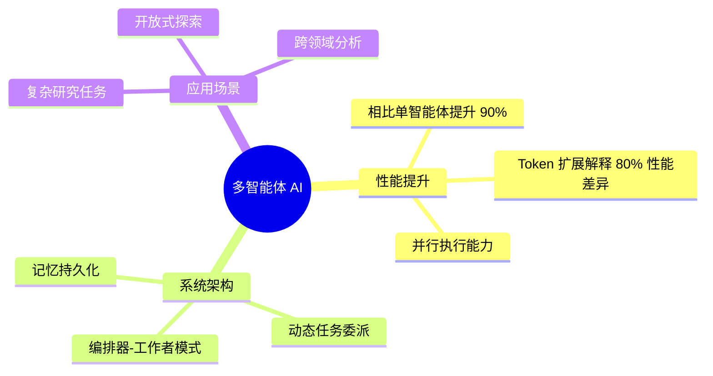
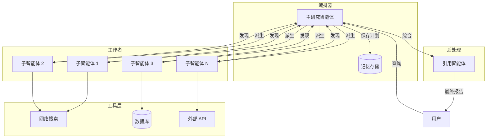
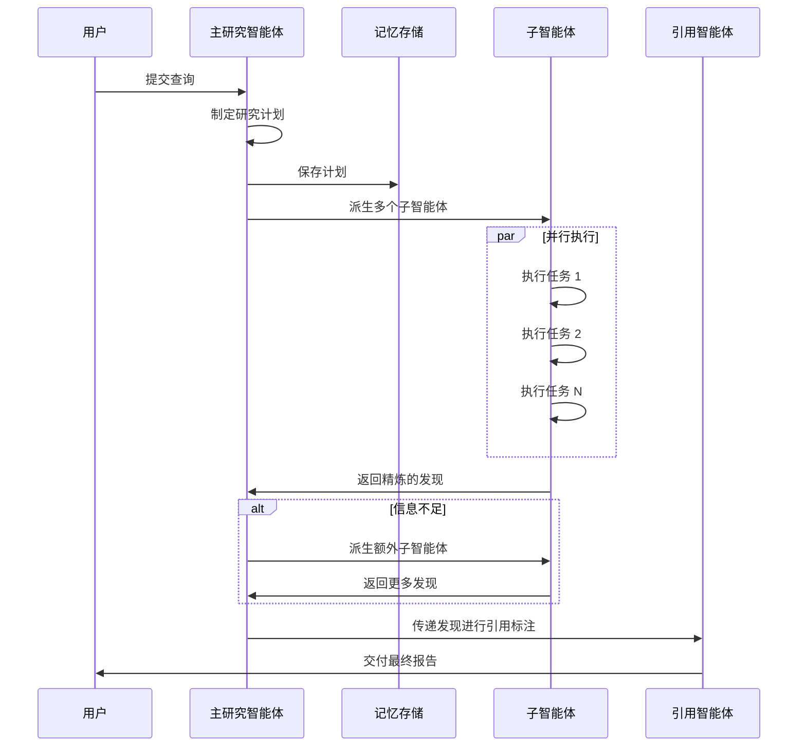
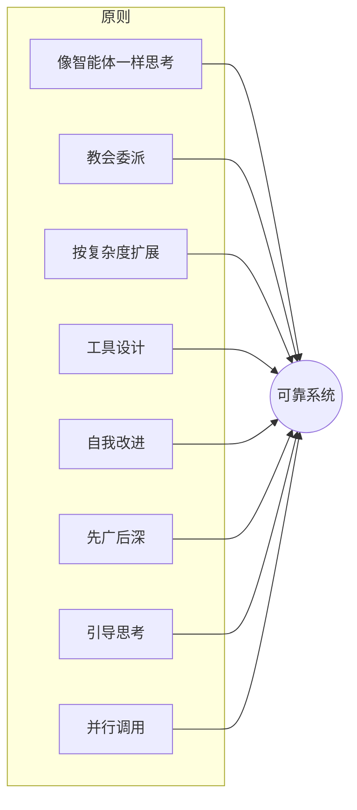
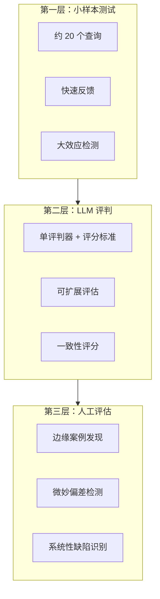
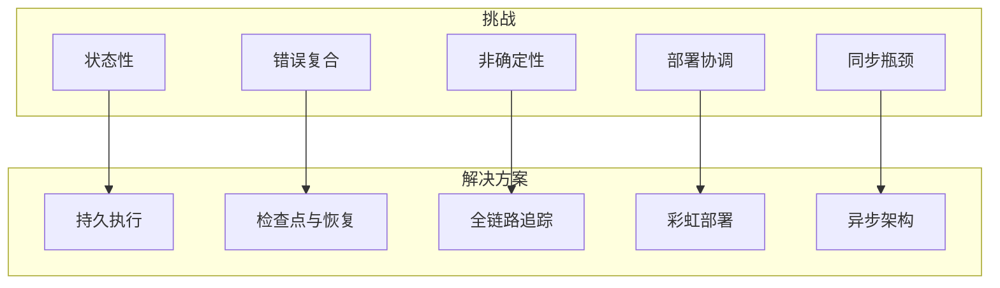
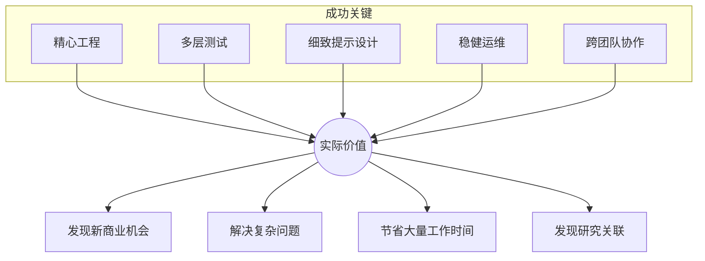

# 构建生产级多智能体 AI 系统架构指南

随着单个 AI 模型能力的不断提升，性能的下一个突破点不仅在于增强单个模型，更在于扩展它们的**集体智能**。多智能体系统——多个大型语言模型协同工作，在协调循环中自主使用工具——标志着我们从线性、一次性流水线向更复杂架构的重大转变。



## 为什么需要多智能体系统？

传统的单智能体系统在处理深度研究的动态性质时往往力不从心。知识发现不是线性的——它需要灵活地转向、探索分支，并根据中间发现更新策略。

### 可量化的收益

| 指标 | 结果 |
|------|------|
| **性能提升** | 相比单智能体提升 90.2% |
| **Token 扩展影响** | 解释了 80% 的性能差异 |
| **任务并行化** | 质量和速度显著提升 |

多智能体系统在以下场景表现出色：
- 高价值、复杂的任务
- 可高度并行化的工作
- 需要处理超出单个上下文窗口的信息
- 需要与多种工具交互

## 系统架构：编排器-工作者框架

系统采用**编排器-工作者模式**，由中央主智能体协调整个研究流程，同时将特定任务委派给专门的工作智能体（子智能体）并行执行。



### 核心组件

| 组件 | 角色 | 职责 |
|------|------|------|
| **主研究智能体** | 编排器 | 分析查询、制定计划、派生子智能体、综合发现 |
| **记忆存储** | 持久化 | 在上下文窗口外存储研究计划，支持长时间运行的任务 |
| **子智能体** | 工作者 | 使用工具并行执行特定研究任务 |
| **引用智能体** | 后处理器 | 审查报告并插入精确的来源引用 |

### 研究工作流程



### 架构优势

相比静态的 RAG 系统，这种动态多步骤方法具有显著优势：

- **自适应搜索**：根据发现持续调整策略
- **并行调查**：独立探索减少路径依赖
- **智能压缩**：子智能体过滤和压缩海量信息
- **关注点分离**：清晰的职责划分便于针对性优化

## 提示工程：引导协作行为

在多智能体系统中，提示工程是引导行为和减轻协调复杂性的主要手段。对主智能体的微小更改可能会不可预测地改变子智能体的行为方式。

### 八项关键原则



#### 1. 像智能体一样思考

建立准确的心智模型，理解智能体如何解释提示。逐步模拟行为以发现故障模式：
- 获得足够结果后仍继续搜索
- 选择错误的工具
- 遗漏明显的信息

#### 2. 教会编排器如何委派

模糊的任务描述会导致重复工作。有效的委派需要包含：

```
✅ 具体目标
✅ 定义输出格式
✅ 工具和来源指导
✅ 明确边界
```

**错误示例**："研究半导体短缺"
**正确示例**："调查 2025 年供应链对汽车行业的影响，重点关注台积电和三星的产能。输出：带来源的要点摘要。"

#### 3. 按查询复杂度扩展工作量

在编排器的提示中嵌入明确的扩展规则：

| 查询类型 | 智能体数量 | 工具调用次数 |
|----------|-----------|-------------|
| 简单事实查询 | 1 | 少量 |
| 中等研究 | 3-5 | 10-20 |
| 复杂分析 | 10+ | 50+ |

#### 4. 工具设计和选择至关重要

智能体必须有明确的工具选择启发式规则：
- 开始前检查所有可用工具
- 将工具使用与用户意图匹配
- 选错工具可能导致任务彻底失败

> 如果智能体在网络上搜索只存在于 Slack 中的上下文，那注定会失败。

#### 5. 让智能体自我改进

将模型用作提示工程师：
- 提供提示 + 故障描述
- 模型诊断问题并建议改进
- 结果：**任务完成时间减少 40%**

#### 6. 先广后深

引导智能体模仿专家的研究方法：


#### 7. 引导思考过程

使用扩展思考模式作为可控的草稿本：
- **主智能体**：规划方法、评估工具、定义角色
- **子智能体**：每次工具调用后评估结果、优化下一步行动

#### 8. 并行工具调用改变速度

实现两种形式的并行化：
- 主智能体并行派生多个子智能体
- 每个子智能体并行使用多个工具

**结果**：复杂查询的研究时间减少高达 **90%**。

## 评估：多层次方法

评估非确定性多智能体系统需要灵活性——智能体可以采取不同但同样有效的路径来实现目标。

### 三层策略



### LLM 评判标准

| 标准 | 描述 |
|------|------|
| **事实准确性** | 声明是否与引用来源匹配？ |
| **引用准确性** | 引用是否指向正确的来源？ |
| **完整性** | 是否涵盖查询的所有方面？ |
| **来源质量** | 是否优先使用权威来源？ |
| **工具效率** | 工具使用是否合理？ |

### 人工评估发现自动化遗漏的问题

人工测试人员发现早期版本始终优先选择 SEO 优化的内容农场，而不是权威的学术来源——这导致了关键的提示改进。

### 有状态智能体的终态评估

对于在多轮对话中修改持久状态的智能体，应关注智能体是否达到了**正确的最终状态**，而不是验证每个中间步骤。

## 生产可靠性工程

从原型到生产的差距是巨大的。智能体系统中的小错误可能会复合并级联成大的、不可预测的行为变化。



### 关键工程挑战

#### 1. 状态性和错误复合

智能体是长时间运行的有状态进程。小故障不能终止整个进程。

**缓解策略**：
- 设计可从错误点恢复的系统
- 实现重试逻辑和定期检查点
- 让智能体在工具失败时自适应
- 将结构化输出写入外部文件系统

#### 2. 调试非确定性系统

当智能体"未能找到明显信息"时，根本原因并不立即清晰。

**解决方案**：实现全链路生产追踪以诊断故障，并监控高层决策模式。

#### 3. 协调安全部署

智能体系统几乎持续运行——标准部署可能会中断活跃的智能体。

**解决方案**：**彩虹部署**逐步转移流量，同时保持新旧版本同时运行。

#### 4. 同步执行瓶颈

同步执行造成信息瓶颈：
- 主智能体无法中途引导子智能体
- 整个系统被单个慢速子智能体阻塞

**未来方向**：异步执行实现更大的并行性（但带来协调挑战）。

### 长对话的上下文管理

生产级智能体参与跨越数百轮的对话。成功的模式包括：
- 总结已完成的工作阶段
- 将关键信息存储在外部记忆中
- 智能压缩上下文同时保持连贯性

## 总结：前进之路



构建生产级多智能体系统需要：

1. **精心的工程设计**确保可靠性
2. **多层次的全面测试**
3. **细致的提示设计**引导行为
4. **稳健的运维实践**支持部署
5. **跨团队协作**——研究、产品和工程团队紧密合作

从原型到生产的道路复杂且充满挑战，但多智能体系统已被证明对复杂、开放式研究任务具有巨大价值。以协调、并行的方式部署智能的能力，正在改变我们处理和解决困难问题的方式。

---

## 参考资料

- [Building effective agents](https://www.anthropic.com/research/building-effective-agents) - Anthropic Research
- [Multi-agent research system](https://www.anthropic.com/engineering/multi-agent-research-system) - Anthropic Engineering

---

*本文基于构建和部署生产级多智能体 AI 系统进行复杂研究任务的实践经验整理。*
