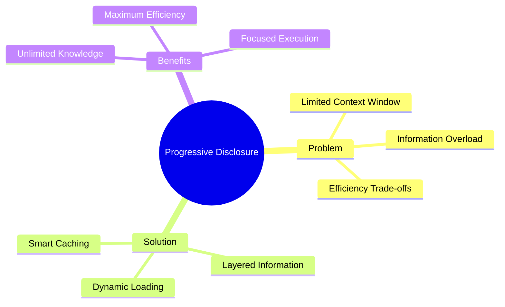
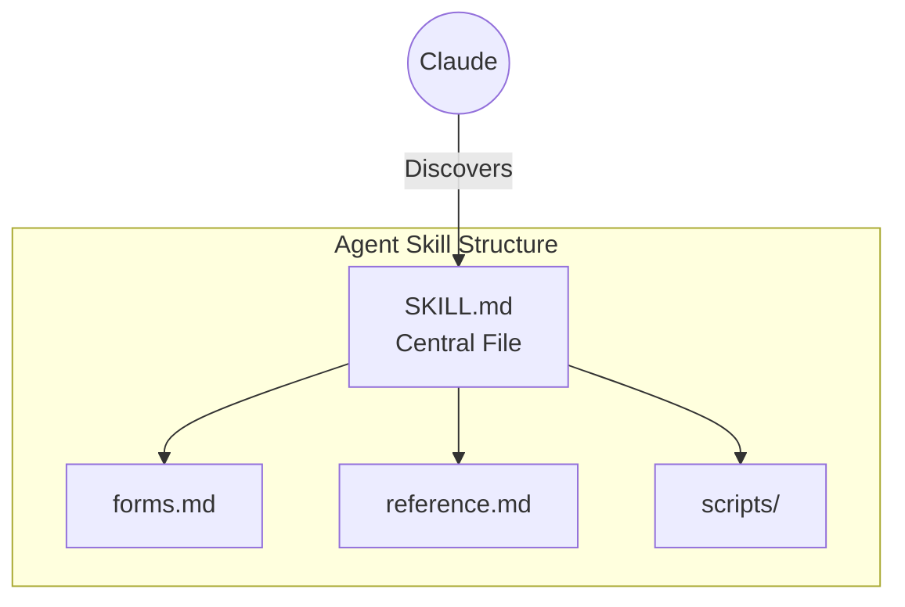
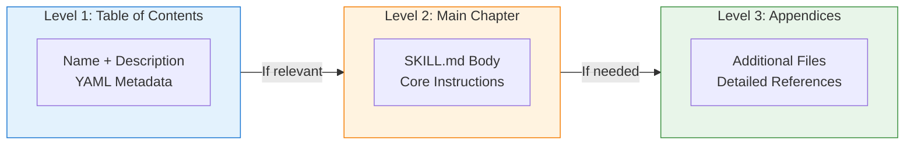
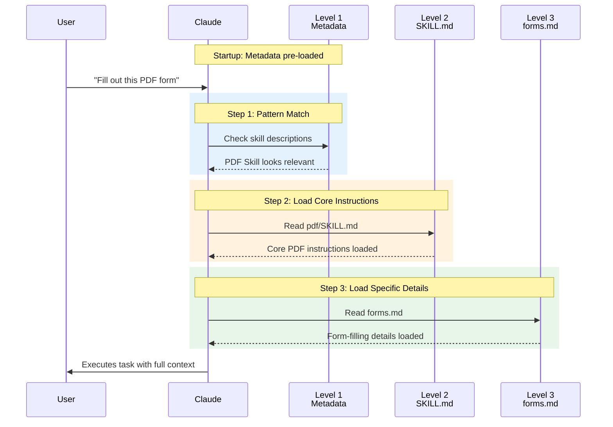
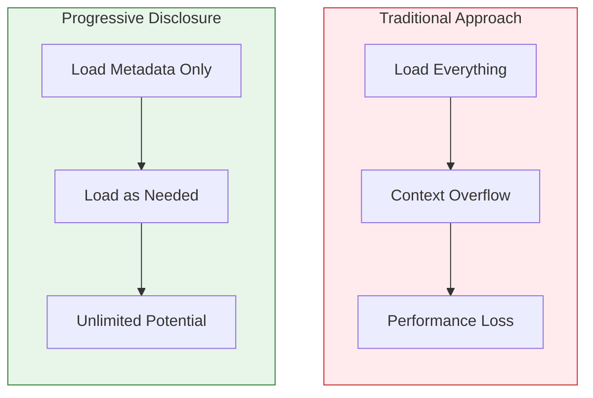
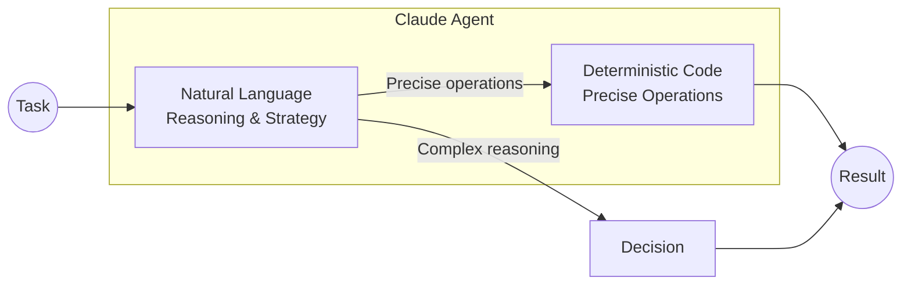
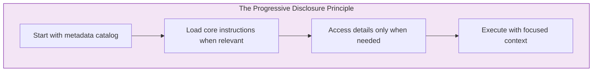

# Progressive Disclosure: How Claude Code Loads Knowledge Like a Smart Librarian

When working with advanced AI like Claude, one of the biggest challenges isn't capability—it's **context management**. Every interaction with an AI happens within a "context window," which you can think of as a small workbench. This workbench has limited space, so placing only the necessary tools and documents on it for the current job is crucial.

Anthropic developed a clever solution called **Agent Skills**, built on a design principle named **Progressive Disclosure**. This principle acts like a smart librarian, giving Claude exactly the information it needs, precisely when it needs it—never too much, never too little.



## What Are Agent Skills?

An **Agent Skill** is an organized folder of textual instructions, executable code, and other resources that an AI agent can discover and load dynamically to perform better at specific tasks. Instead of being a jack-of-all-trades, an agent can use skills to become an expert in a particular area.



**Primary Goals of Agent Skills:**

| Goal | Description |
|------|-------------|
| **Specialization** | Transform a general-purpose agent into a specialized one tailored to specific needs |
| **Composability** | Package expertise into reusable resources, like creating a detailed onboarding guide |

Every skill is built around a central file called `SKILL.md`. The way an agent interacts with this file and its related resources is the key to understanding Progressive Disclosure.

## The Three Levels of Progressive Disclosure

At its heart, Progressive Disclosure is a simple but powerful idea: **reveal information in layers**, from a brief overview to comprehensive detail, only as it becomes necessary.



### Level 1: The Table of Contents

The SKILL.md's YAML frontmatter contains just the `name` and `description` metadata. This provides **just enough information** for Claude to know the skill exists and what it's for, without loading the whole file.

```yaml
# Example: PDF Skill metadata
name: "PDF Skill"
description: "Manipulate PDF documents, fill forms, extract text"
```

**Key Point:** This metadata is pre-loaded at startup, acting like a library catalog.

### Level 2: The Main Chapter

Claude reads the main body of the SKILL.md file **only if the metadata suggests the skill is relevant** to the user's task. This level provides the core instructions and workflow for the skill.

### Level 3 & Beyond: The Appendices

Additional linked files within the skill directory (e.g., `forms.md`, `reference.md`) contain highly specific or lengthy information. Claude reads these files **only on an as-needed basis** for very specific sub-tasks.

## Progressive Disclosure in Action

Let's walk through a practical example with a "PDF Skill" designed to give Claude abilities to manipulate PDF documents.



### Step-by-Step Breakdown

| Step | Action | Context Window State |
|------|--------|---------------------|
| **Startup** | Core instructions + Level 1 metadata loaded | Minimal, ready for any task |
| **Skill Trigger** | User asks to fill PDF form | Pattern matched to PDF Skill |
| **Level 2 Load** | Claude reads SKILL.md body | Core instructions added |
| **Level 3 Load** | Claude reads forms.md | Specialized knowledge added |
| **Execution** | Claude performs the task | All necessary context present |

## Why This Matters: Key Benefits

Progressive Disclosure provides three significant advantages that change what's possible with AI agents.

### 1. Solves the Context Window Limit



By loading information only as needed, agents don't have to read the entirety of a skill at once. This elegant solution means that **the amount of context that can be bundled into a skill is effectively unbounded**.

> Developers can build an entire library of organizational knowledge, and the agent can navigate it like a human would—one document at a time.

### 2. Ensures Efficiency and Scalability

The system keeps interactions lean and fast by loading only what is necessary for the immediate task.

| Metric | Without Progressive Disclosure | With Progressive Disclosure |
|--------|-------------------------------|----------------------------|
| Startup Time | Slow (load everything) | Fast (metadata only) |
| Memory Usage | High (all skills loaded) | Low (on-demand loading) |
| Response Speed | Degraded | Optimal |
| Skill Capacity | Limited | Unlimited |

### 3. Combines Natural Language with Deterministic Code

Skills can include pre-written scripts that Claude can execute as tools. For tasks like sorting a large dataset or extracting form fields from a PDF, traditional code is far more efficient and reliable than generating a solution with a language model.



**Benefits:**
- Natural language for reasoning and strategy
- Deterministic code for precise, repeatable operations
- Consistency and cost savings

## Practical Implementation Tips

When building Agent Skills with Progressive Disclosure in mind:

### Structure Your SKILL.md Effectively

```markdown
# Good Structure
---
name: "My Skill"
description: "Brief, searchable description"
---

## Quick Start (Level 2)
Core instructions that apply to most use cases.

## See Also
- [detailed-guide.md](./detailed-guide.md) - For complex scenarios
- [reference.md](./reference.md) - API documentation
```

### Keep Metadata Descriptive but Concise

The Level 1 metadata should be **searchable and distinctive**:

| Good Description | Why It Works |
|-----------------|--------------|
| "Fill PDF forms, extract text, merge documents" | Specific, actionable keywords |
| "Handle PDF files" | Too vague, might not trigger correctly |

### Organize Appendices Logically

```
my-skill/
  SKILL.md           # Core instructions
  forms.md           # Form-specific details
  extraction.md      # Text extraction details
  scripts/
    fill_form.py     # Deterministic code
    extract_text.py
```

## Conclusion

Progressive Disclosure is a system of loading information in smart, incremental layers—starting with a brief summary, moving to core instructions, and finally accessing detailed appendices as needed.



This method allows Claude to be equipped with a vast library of specialized knowledge while keeping its active "workbench"—the context window—clean, organized, and focused on the task at hand.

**Key Takeaways:**

| Principle | Benefit |
|-----------|---------|
| Layered Loading | Unlimited skill capacity |
| On-Demand Access | Maximum efficiency |
| Smart Caching | Fast response times |
| Code Integration | Reliable operations |

Progressive Disclosure is what allows Agent Skills to be both incredibly deep in their expertise and remarkably efficient in their execution—the best of both worlds for AI agents.

---

## References

- [Claude Code Agent Skills Documentation](https://docs.anthropic.com/en/docs/claude-code/skills) - Anthropic Docs
- [Building effective agents](https://www.anthropic.com/research/building-effective-agents) - Anthropic Research

---

*Ready to build smarter AI agents? Start thinking about Progressive Disclosure—it's the key to creating agents that are both knowledgeable and efficient.*
