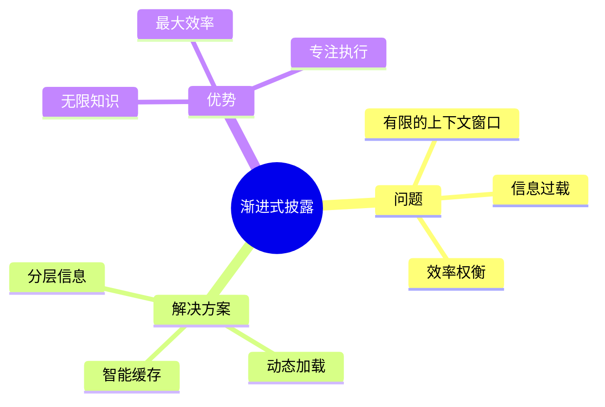
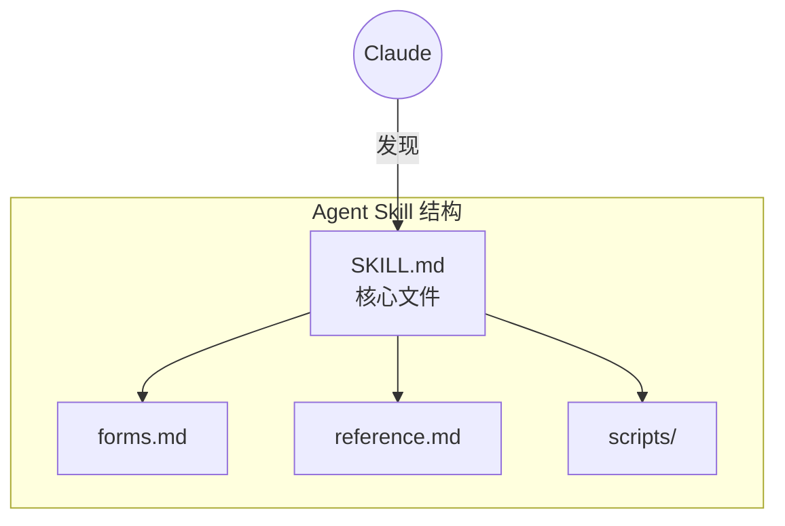
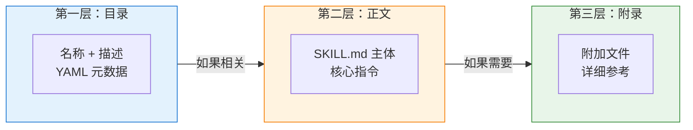
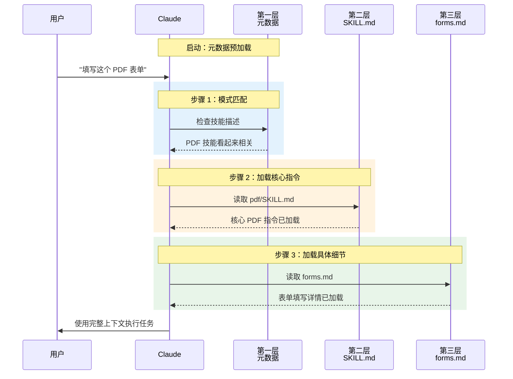
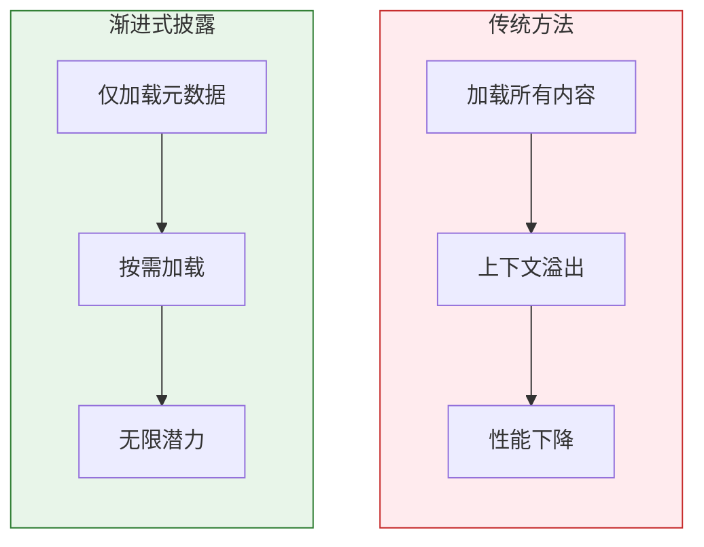
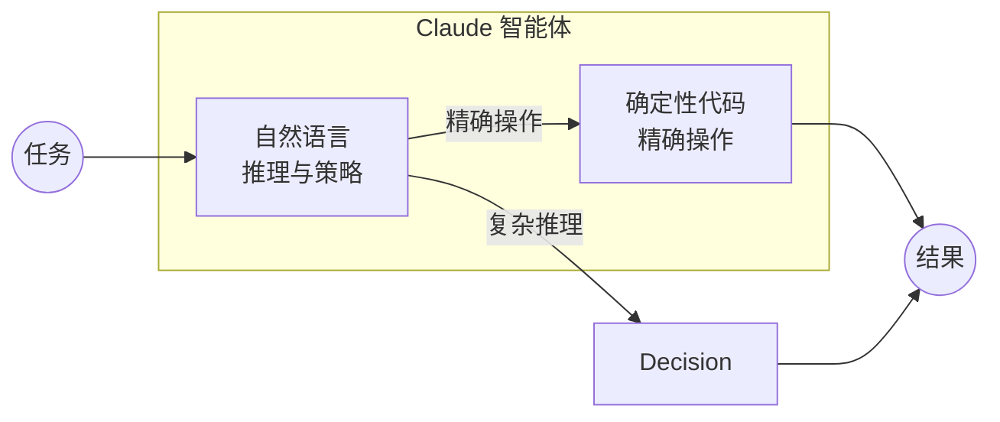

# 渐进式披露：Claude Code 如何像智能图书管理员一样加载知识

在使用 Claude 这样的高级 AI 时，最大的挑战并不是能力——而是**上下文管理**。每次与 AI 的交互都发生在"上下文窗口"中，你可以把它想象成一个小型工作台。这个工作台空间有限，所以只在上面放置当前任务所需的工具和文档至关重要。

Anthropic 开发了一个巧妙的解决方案，叫做 **Agent Skills**，它基于一个名为**渐进式披露（Progressive Disclosure）**的设计原则。这个原则就像一个智能图书管理员，在恰当的时机为 Claude 提供恰当的信息——不多不少，刚刚好。



## 什么是 Agent Skills？

**Agent Skill** 是一个有组织的文件夹，包含文本指令、可执行代码和其他资源，AI 智能体可以动态发现和加载这些资源，以更好地完成特定任务。智能体不再是"万金油"，而是可以通过技能成为特定领域的专家。



**Agent Skills 的主要目标：**

| 目标 | 描述 |
|------|------|
| **专业化** | 将通用智能体转变为针对特定需求的专业智能体 |
| **可组合性** | 将专业知识打包成可复用的资源，就像创建详细的入职指南 |

每个技能都围绕一个名为 `SKILL.md` 的核心文件构建。智能体与这个文件及其相关资源的交互方式，是理解渐进式披露的关键。

## 渐进式披露的三个层级

渐进式披露的核心是一个简单但强大的理念：**分层揭示信息**，从简要概述到详细内容，只在必要时才展开。



### 第一层：目录

SKILL.md 的 YAML 头部只包含 `name` 和 `description` 元数据。这提供了**刚好足够的信息**，让 Claude 知道技能的存在和用途，而无需加载整个文件。

```yaml
# 示例：PDF 技能元数据
name: "PDF Skill"
description: "操作 PDF 文档，填写表单，提取文本"
```

**关键点：** 这些元数据在启动时预加载，就像图书馆目录一样。

### 第二层：正文

**只有当元数据表明技能与用户任务相关时**，Claude 才会读取 SKILL.md 文件的主体。这一层提供了技能的核心指令和工作流程。

### 第三层及更深：附录

技能目录中的附加链接文件（如 `forms.md`、`reference.md`）包含高度具体或冗长的信息。Claude **仅在需要时**才读取这些文件，用于非常具体的子任务。

## 渐进式披露实战演示

让我们通过一个实际例子来理解——一个设计用来操作 PDF 文档的"PDF 技能"。



### 逐步分解

| 步骤 | 操作 | 上下文窗口状态 |
|------|------|----------------|
| **启动** | 核心指令 + 第一层元数据加载 | 最小化，准备好处理任何任务 |
| **技能触发** | 用户要求填写 PDF 表单 | 模式匹配到 PDF 技能 |
| **第二层加载** | Claude 读取 SKILL.md 主体 | 添加核心指令 |
| **第三层加载** | Claude 读取 forms.md | 添加专业知识 |
| **执行** | Claude 执行任务 | 所有必要上下文就位 |

## 为什么这很重要：核心优势

渐进式披露提供了三个重大优势，改变了 AI 智能体的可能性边界。

### 1. 解决上下文窗口限制



通过仅在需要时加载信息，智能体不必一次性读取整个技能。这个优雅的解决方案意味着**技能中可以打包的上下文量实际上是无限的**。

> 开发者可以构建一整套组织知识库，智能体可以像人类一样在其中导航——一次查阅一个文档。

### 2. 确保效率和可扩展性

系统通过仅加载当前任务所需的内容，保持交互的精简和快速。

| 指标 | 无渐进式披露 | 有渐进式披露 |
|------|--------------|--------------|
| 启动时间 | 慢（加载所有内容） | 快（仅元数据） |
| 内存使用 | 高（所有技能加载） | 低（按需加载） |
| 响应速度 | 下降 | 最优 |
| 技能容量 | 有限 | 无限 |

### 3. 结合自然语言与确定性代码

技能可以包含预编写的脚本，Claude 可以作为工具执行。对于排序大型数据集或从 PDF 中提取表单字段等任务，传统代码比用语言模型生成解决方案更高效、更可靠。



**优势：**
- 自然语言用于推理和策略
- 确定性代码用于精确、可重复的操作
- 一致性和成本节约

## 实践实施建议

在构建考虑渐进式披露的 Agent Skills 时：

### 有效组织你的 SKILL.md

```markdown
# 良好的结构
---
name: "My Skill"
description: "简短、可搜索的描述"
---

## 快速入门（第二层）
适用于大多数用例的核心指令。

## 另请参阅
- [detailed-guide.md](./detailed-guide.md) - 复杂场景
- [reference.md](./reference.md) - API 文档
```

### 保持元数据描述性但简洁

第一层元数据应该是**可搜索且有区分度的**：

| 好的描述 | 为什么有效 |
|----------|------------|
| "填写 PDF 表单，提取文本，合并文档" | 具体、可操作的关键词 |
| "处理 PDF 文件" | 太模糊，可能无法正确触发 |

### 逻辑组织附录

```
my-skill/
  SKILL.md           # 核心指令
  forms.md           # 表单相关细节
  extraction.md      # 文本提取细节
  scripts/
    fill_form.py     # 确定性代码
    extract_text.py
```

## 总结

渐进式披露是一种分层加载信息的智能系统——从简要摘要开始，进入核心指令，最后在需要时访问详细附录。


这种方法使 Claude 能够装备庞大的专业知识库，同时保持其活跃的"工作台"——上下文窗口——干净、有序、专注于手头的任务。

**关键要点：**

| 原则 | 优势 |
|------|------|
| 分层加载 | 无限技能容量 |
| 按需访问 | 最大效率 |
| 智能缓存 | 快速响应 |
| 代码集成 | 可靠操作 |

渐进式披露使 Agent Skills 能够同时具备深厚的专业知识和卓越的执行效率——这是 AI 智能体的最佳状态。

---

## 参考资料

- [Claude Code Agent Skills 文档](https://docs.anthropic.com/en/docs/claude-code/skills) - Anthropic Docs
- [Building effective agents](https://www.anthropic.com/research/building-effective-agents) - Anthropic Research

---

*准备好构建更智能的 AI 智能体了吗？开始思考渐进式披露——这是创建既博学又高效的智能体的关键。*
